[TOC]

# 物理层

## 物理层的基本概念

**物理层解决如何在连接各种计算机的传输媒体上传输数据比特流，而不是指具体的传输媒体**

**主要任务：确定与传输媒体接口的一些特性：**

- 机械特性：接口形状、大小、引脚 数码
- 电气特性：如规定电压范围（-5V到+5）
- 功能特性：如规定-5V表示0.+5V表示1
- 过程特性：规定连接时各个相关部件的工作步骤

### 基本术语

1. 数据：运送消息的实体

2. 信号：数据的电气的或者电磁的表现，或者说信号时适合在传输介质上传输的对象

   1. 模拟信号：代表消息的参数的取值时连续的
   2. 数字信号：代表消息的参数子在取值时时离散的

3. 码元：使用时间域的波形来表示数字信号时，表示不同的离散数值的基本波形。

4. 比特率：单位时间内传送的比特数

5. 波特率：单位时间内载波调制状态改变的次数，针对数据信号对载波的调制速率

6. 奈氏准则：在任何信道中，码元的传输的效率是有上限的，传输速率超过此上限，就会出现严重的码间串扰问题。使接收端对码元的判决（即识别）成为不可能。

7. 信噪比：信号的平均功率和噪声的平均功率之比，记为S/N。信噪比（dB）=10*log10（S/N）

   

   #### 

### 有关信道的基本概念

**信道**：信号的传输媒体，有以下几种通信方式

- 单工通信（单向通信)：只有一个方向的通信，无反方向的通信（如广播电视）
- 半双工通信（双向交替通信）：通信双方可以互发消息，但是不能同时发消息（如对讲机）
- 全双工通信（双向同时通信）：可以同时收发信息（如打电话）

**基带信号：**来自信源的信号，指没有经过调制的数字信号或模拟信号。如计算机输出的数据信号：文件，

**调制：**基带信号中包含了许多低频的成分，甚至直流的成分，许多信道不支持低频或者直流分量，因此必须对基带信号进行调频

**带通信号**：基带信号经过载波调制后，把频率范围搬移到较高判断以便在信道中传输（频率高能使信号传输距离更远）
**几种最基本的调制方法**

- 调幅（AM）：载波的振幅随基带数字信号而变化。
- 调频（FM）：载波的频率随基带的数字信号而变化
- 调相（PM）：在波的初始相位随基带数字信号而变化

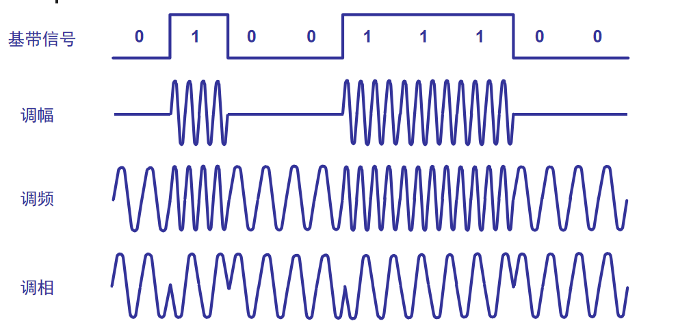

**常用编码**

- 单极性不归零码：只使用一个电压值，高电平表示1，没电压表示0（如图a）
- 双极性不归零码：用正电平和负电平分别表示二进制数据的0和1，正负幅值相等(如图b)

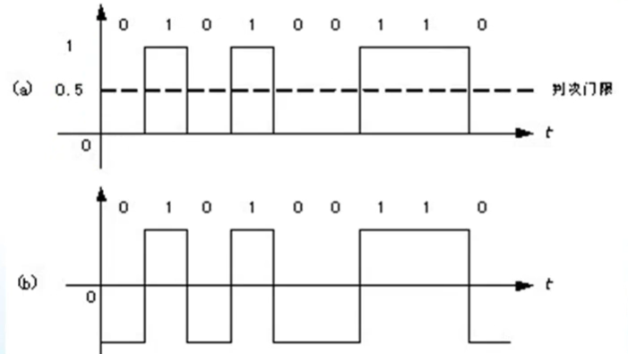

-  单极性归零码：只使用一个电压值，高电平表示1，没电压表示0（如图a）
- 双极性归零码：用正电平和负电平分别表示二进制数据的0和1，正负幅值相等(如图b)

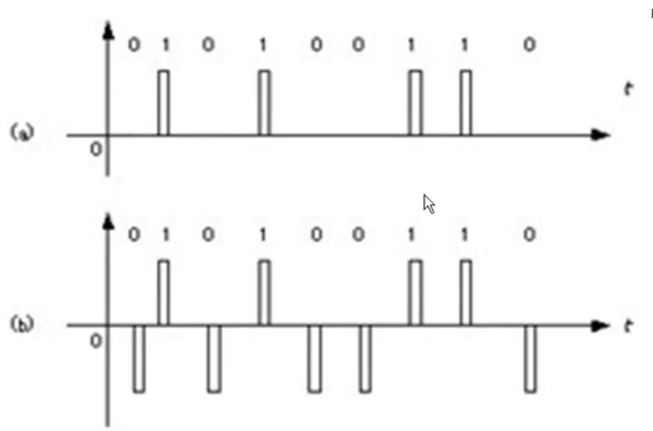

- 曼彻斯特编码：位周期中心向上跳代表0，向下跳代表1

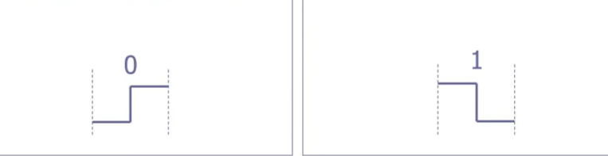

- 差分曼彻斯特编码：位中心始终有跳变，边界有跳变代表0，无跳变代表1

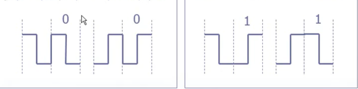

> 差分曼彻斯特编码与曼彻斯特编码相同，但是抗干扰性能强于曼彻斯特编码
>
> 曼彻斯特编码与前两种相比能够表示没有数据传输，具有自同步能力

### 奈氏准则和和香农定理

因为在任何实际的信道中，在传输信号的适合会产生各种失真以及带来多种干扰， 码元传输的速率越高，或者传输的距离越远，在信道中输出端的波形的失真就越严重

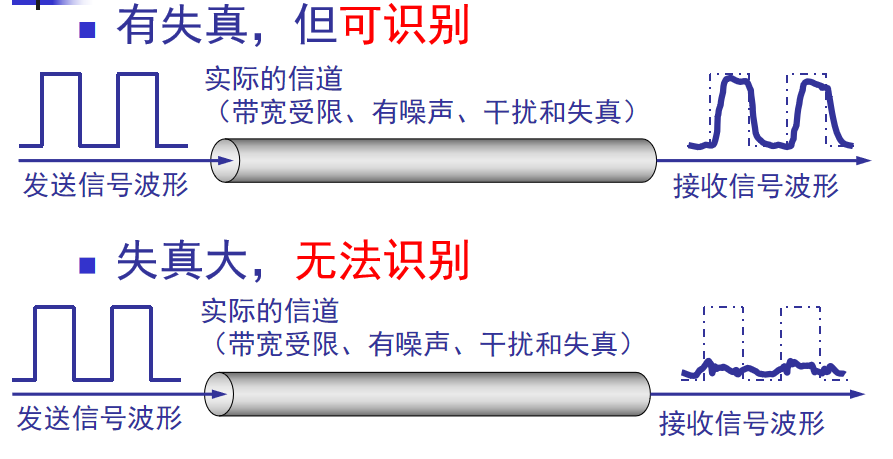

**奈氏准则**：在任何信道中，码元传输的速率是有**上限**的，否则就会出现码间串扰的问题，使接收端对码元的判决（即识别）成为不可能。如果信道的**频带越宽**，也就是能够通过的信号**高频分量**越多，那么就可以用更高的速率传送码元而不出现码间串扰。

 理想低通信道最高码元传输速率=2WBaud（无干扰）

- W是理想低通信道的带宽，单位是Hz
- Baud是波特，是码元传输速率的单位

**波特和比特的区别**

> Bit是信息量，如果一个码元含有三个Bit的信息量，1波特=3Bit/s （000-111）

**香农定理**

> 香农定理给出了带宽受限且有高斯白噪声干扰的信道的极限，无差错的信息传输速率

**定义为：**
$$
C=Wlog2(1+S/N)   b/s
$$

- W为信道的带宽（Hz）
- S为信道内所传信号的平均功率
- N为信道内部的高斯噪声功率

信噪比：信号的平均规律和噪声的平均功率之比。记为S/N，用dB为度量单位。
香农公式表明：信道的**带宽**或信道中的**信噪比越大**，信息的**极限传输速率就越高。**
香农公式和奈氏准则适用范围：
香农公式：仅模拟信
奈氏准则：模拟信号、数字信号都可。

**奈氏准则和香农定理应用范围：**

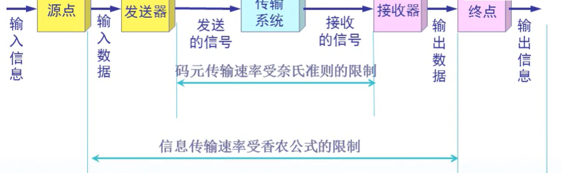

## 物理层下的传输媒体

传输媒体分两大类

1. 导引型传输媒体：通过固定媒体（铜线或者光纤）传播
2. 非导引型传输媒体：在自由空间中传播（无线传播）

### 导引型传输媒体

**双绞线**

- 屏蔽双绞线STP
- 无屏蔽双绞线UTP

**同轴电缆**

- 50欧同轴电缆：用于数字传输，多用于基带传输
- 70欧同轴电缆：用于模拟传输

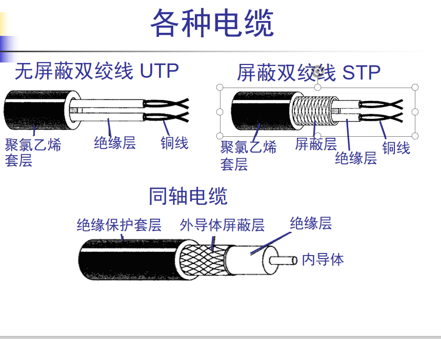

**光纤**（外部干扰对其影响比较小）

**光线在光纤中的反折射**

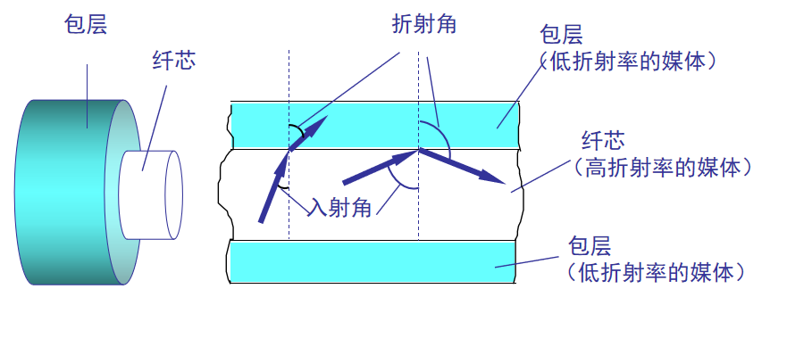

光纤内部工作原理

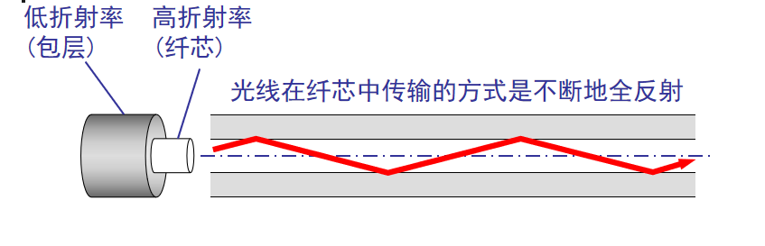

多模光纤和单模光纤

- 单模光纤：光纤直径较小到一定的范围，使光线在传播中不产生多次反射，传播性能好
- 多模光纤：多条不同角度入射的光线在同一条光纤中传输（适合近距离）

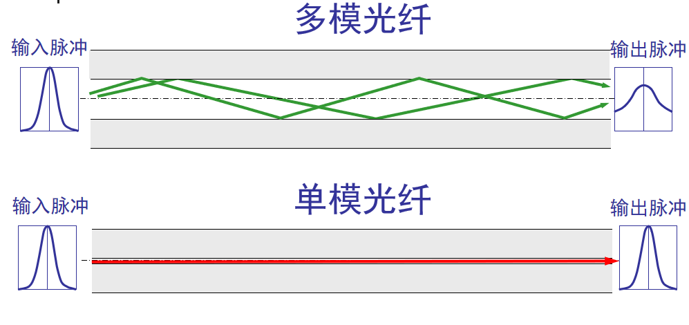

### 非导引型传输媒体

- 无线传输所使用的**频段很广**。
- 短波通信主要是靠电离层的反射，但短波信道的**通信质量较差**。
- 微波在空间主要是直线传播
  - 地面微波接力通信
  - 卫星通信

## 信道复用技术

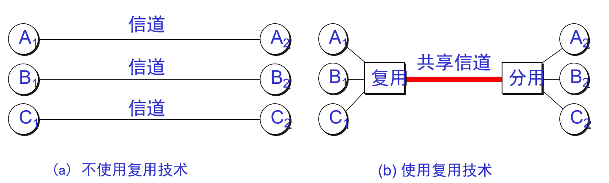

### 频分复用FDM

用户在分配到一定的频带后，在通信过程中自始至终都占用这个频带。
频分复用的所有用户在同样的时间占用不同的带宽资源（请注意，这里的“带宽”是频率带宽而不是数据的发送速率）

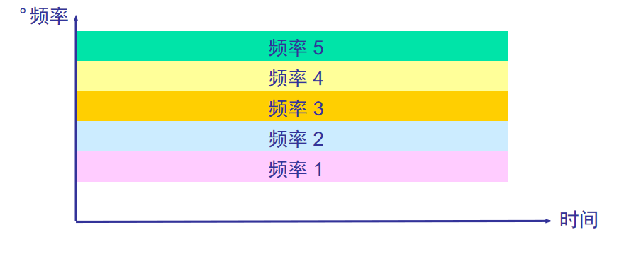

### 时分复用（Time Diviion Mutiplexing）

时分复用技术则是将时间划分为一段段等长的**时分复用帧**（TDM帧）。每一个时分复用的用户在每一个TMD帧中占用了固定的时间段，时分复用的所有用户是在不同的时间占用同样的**频带宽度**

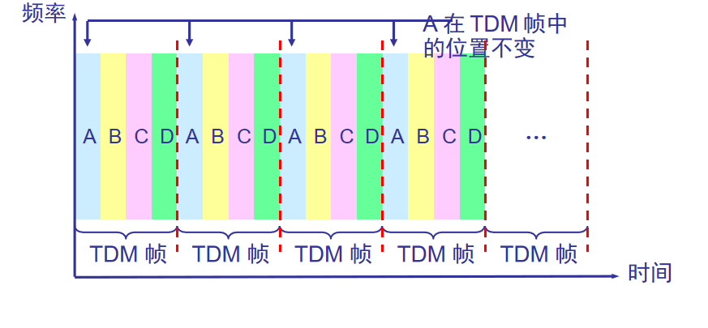

对于一些用户没使用信道时，则会造成资源浪费。

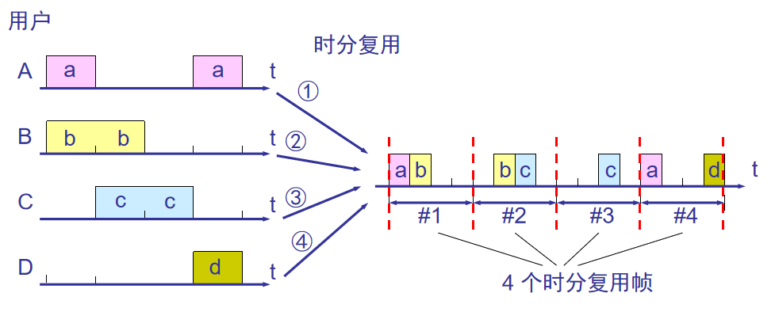

因此对于这个缺点，出现了改进的时分复用技术：**统计时分复用技术**

在数据帧中添加标记，来区分数据来源

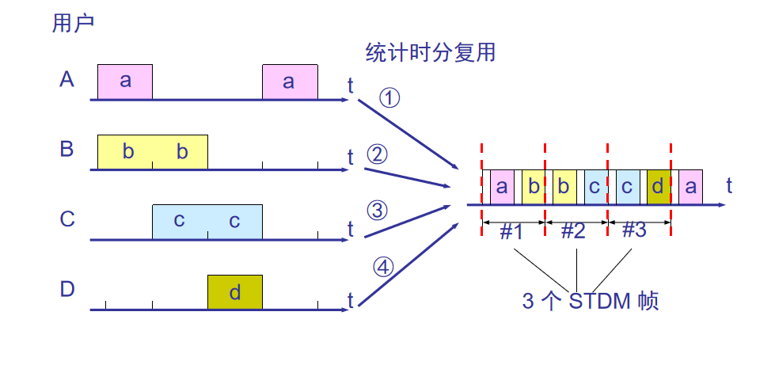

### 波分复用WDM

波分复用就是对光的频分复用

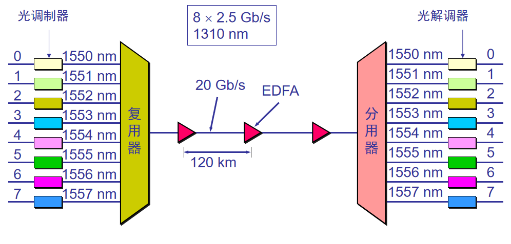

### 码分复用CDM(code Division multiplexing) 

​	各个用户使用经过挑选的不同码型，靠不同的编码来区分各个用户原始信号的一种复用方式

​	每一个比特时间划分为**m个短的时间间隔**，称为**码片**

​	每个站被指派一个唯一的一个m bit码片序列

- 如果发送比特1，则发送自己的m bit码片序列
- 如果发送比特0，则发送该码片序列的二进制反码

 **特点**

- 每个站分配的码片序列不仅必须各不相同，并且还必须互相正交(orthogonal)。
- 在实用的系统中是使用伪随机码序列。

- 令向量 S 表示站 S 的码片向量，令 T 表示其他任何站的码片向量。两个不同站的码片序列正交，就是向量 S 和T 的规格化内积(inner product)都是 0：

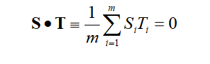

示例：

令向量 S 为(–1 –1 –1 +1 +1 –1 +1 +1)，向量 T 为(–1 –1 +1 –1 +1 +1 +1 –1)。 
把向量 S 和 T 的各分量值代入(2-3)式就可看出这两个码片序列是正交的。 

他们每个位数相乘，除于8结果为0

另一个特点就是任何一个码片向量和该码片向量自己的规格化内积都是1 。
一个码片向量和该码片反码的向量的规格化内积值是 –1。

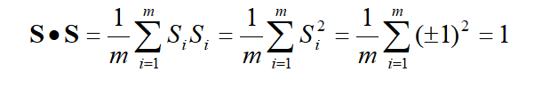

**CDMA的工作原理**

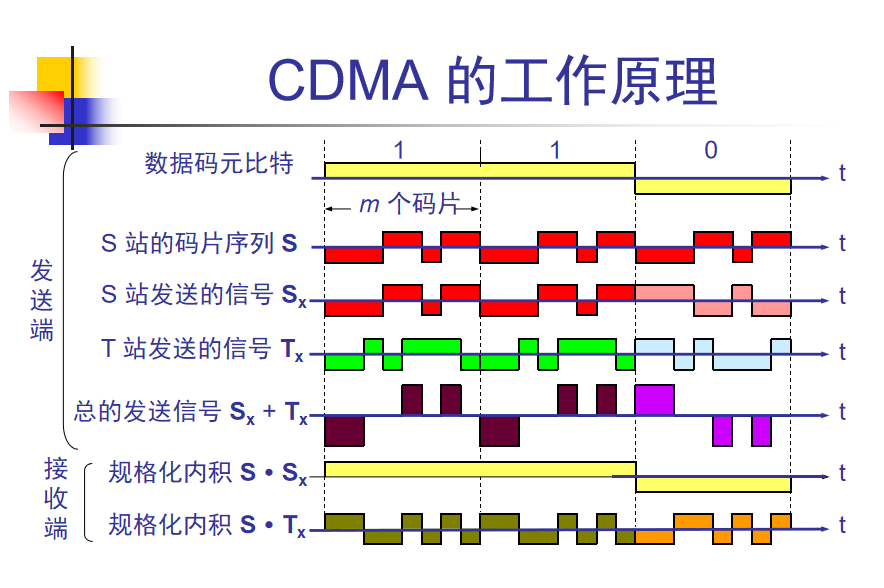

分析：在S站发送1时，与**S站的码片序列与扩频序列Sx的内积为1**，**发送0时内积为-1.**而其他站**（T）**的发送信号与**S站**的码片序列**内积都为0**，就会被过滤掉，因此最终就能得到我们需要的接受的站的信号。（可以对照着图看格式化内积的公式，动手运算一遍就理解了）

例题：如下面四个码片序列

 A：（-1，-1，-1，+1，+1，-1，+1，+1）

 B：（-1，-1，+1，-1，+1，+1，+1，-1）

 C：（-1，+1，-1，+1，+1，+1，-1，-1）

 D：（-1，+1，-1，-1，-1，-1，+1，+1）

收到的码片序列为R：（-1，+1，-3，+1，-1，-3，+1，+1）

A*R=(1-1+3+1-1+3+1+1)/8=1                   

 B*R=(1-1-3-1-1-3+1-1)/8=-1          

C和R的格式化内积为0，D和R的格式化内积为1 

由结果可知，C没收到信号，其他的均收到了这个格式化内积的信号

## 数字传输系统

早期数字传输系统主要有两个缺点：

- 速率标准不统一
  - 如果不对高次群的数字传输速率进行标准化，国际范围的高速数据传输就很难实现。 

- 不是同步传输
  - 在过去相当长的时间，为了节约经费，各国的数字网主要是采用**准同步方式。** 

脉码调制 PCM 体制最初是为了在电话局之间的中继线上传送多路的电话。

- 由于历史上的原因，PCM 有两个互不兼容的国际标准，即北美的 24 路PCM（简称为 T1）和欧洲的 30 路 PCM（简称为 E1）。我国采用的是欧洲的 E1 标准。
- E1 的速率是 2.048 Mb/s，而 T1 的速率是 1.544Mb/s。

- 当需要有更高的数据率时，可采用复用的方法

1、**同步光纤网络**SONET。整个同步光纤网络的主时钟来自于一个非常昂贵的铯原子钟；其基础传输速率是51.82Mbit/s，此速率对电信号称为**第1级同步传送信号**，即STS-1；对光信号称为第1级**光载波**，即OC-1。

2、**同步数字系列**SDH（以SONET为基础），一般认为SDH和SONET是同义词，不同点在于 SDH的基本速率是155.52Mbit/s，称为**第1级同步传送模块**，即STM-1，相当于SONET中OC-3的速率。

## 宽带接入技术

### ADSL技术

ADSL(Asymmetric Digital Subscriber Line)：非对称

xDSL技术就时用数字技术对现有的模拟电话用户线进行改造，使它能够承载宽带业务（DSL 就是数字用户线(Digital Subscriber Line)的缩写。而 DSL 的前缀 x 则表示在数字用户线上实现的不同宽带方案。 ）

如图，该技术将0-4kHz的地段频率谱段留给传统的电话使用，而原来没有使用的高端频率谱段留给用户上网使用。其中，26-108Hz的频谱留给用户上传数据、138-1104留给用户下载数据使用

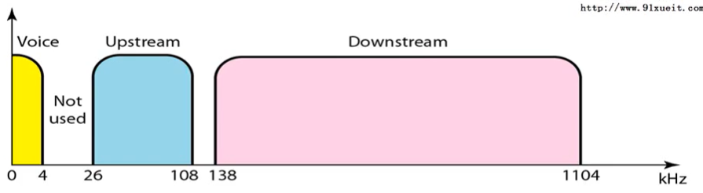

而接入则使用分离器分离信号，低频的信号则接电话，高频的接电脑。（一般在用户的两端都有ADSL调制解调器）

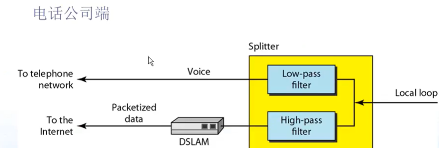

### DMT技术

1. DMT 调制技术采用**频分复用**的方法，把 40 kHz 以上一直到 1.1 MHz 的高端频谱划分为许多的子信道，其中 25 个子信道用于上行信道，而 249 个子信道用于下行信道。
2. 每个子信道占据 4 kHz 带宽（严格讲是 4.3125 kHz），并使用不同的载波（即不同的音调）进行数字调制。这种做法相当于在一对用户线上使用许多小的调制解调器并行地传送数据。

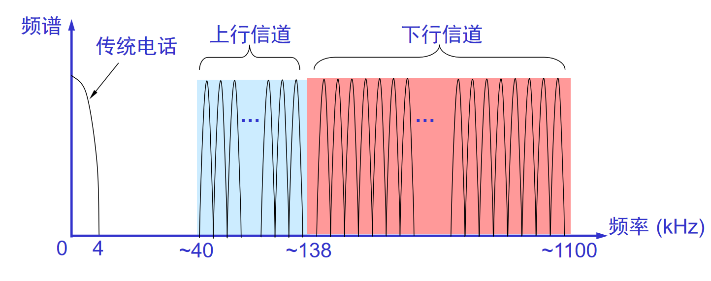

### 光纤同轴混合网（HFC）Hybrid Fiber Coax

HFC网是在目前覆盖很广的有线电视网CATV的基础上开发的一种居民宽带接入网。

HFC 网除可传送 CATV 外，还提供电话、数据和其他宽带交互型业务。

现有的 CATV 网是树形拓扑结构的同轴电缆网络，它采用模拟技术的频分复用对电视节目进行单向传输。而 HFC 网则需要对 CATV 网进行改造，  

**HFC的主要特点**

- HFC网的主干线路采用**光纤**，HFC 网将原 CATV 网中的同轴电缆主干部分改换为光纤，并使用**模拟光纤技术。**
- 在模拟光纤中采用光的**振幅调制 AM**，这比使用数字光纤更为经济。
- 模拟光纤从头端连接到光纤结点(fiber node)，即光分配结点 ODN (Optical Distribution Node)。在光纤结点光信号被转换为电信号。在光纤结点以下就是同轴电缆。

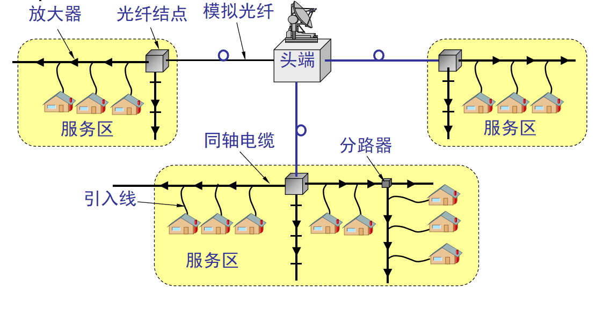

### FTTx 技术 （光纤到……）

FTTx（光纤到……）也是一种实现宽带居民接入网的方案。这里字母 x 可代表不同意思。

- 光纤到家 FTTH (Fiber To The Home)：光纤一直铺设到用户家庭可能是居民接入网最后的解决方法。
- **光纤到大楼 FTTB** (Fiber To The Building)：光纤进入大楼后就转换为电信号，然后用电缆或双绞线分配到各用户。
- 光纤到路边 FTTC (Fiber To The Curb)：从路边到各用户可使用星形结构双绞线作为传输媒体。 

## 物理层设备

### 中继器

​	中继器又称转发器，主要工作内容是将信号放大再转发出去，以消除信号经过一段长时间的电缆后，因为噪声或者其他原因而造成的失真和衰减。（增加信号强度），他工作于物理层，只是起到扩展传输距离的作用，对高层协议是透明的。

优点

- 扩大了通信距离。
- 增加了节点的最大数目。
- 各个网段可使用不同的通信速率。
- 提高了可靠性。当网络出现故障时，一般只影响个别网段。
- 性能得到改善

### 缺点

- 由于中继器对收到被衰减的信号再生（恢复）到发送时的状态，并转发出去，增加了延时。
- CAN总线的MAC子层并没有流量控制功能。当网络上的负荷很重时，可能因中继器中缓冲区的存储空间不够而发生溢出，以致产生帧丢失的现象。
- 中继器若出现故障，对相邻两个子网的工作都将产生影响。

### 集线器（Hub）

集线器实质上是一个多端口的中继器，Hub主要使用双绞线组建共享网络，集线器的主要功能是对接收到的信号进行再生整形放大，以扩大网络的传输距离，同时把所有节点集中在以它为中心的节点上。

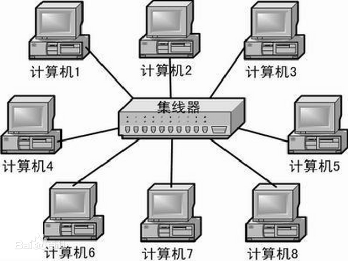

## 几种基本的调制方法

基带信号往往包含有较多的低频成分，甚至有直流成分，而许多信道并不能传输这种低频分量或直流分量。为了解决这一问题，就必须对基带信号进行调制(modulation)。

最基本的二元制调制方法有以下几种：

- 调幅(AM)：载波的振幅随基带数字信号而变化。 
- 调频(FM)：载波的频率随基带数字信号而变化。
- 调相(PM) ：载波的初始相位随基带数字信号而变化。  

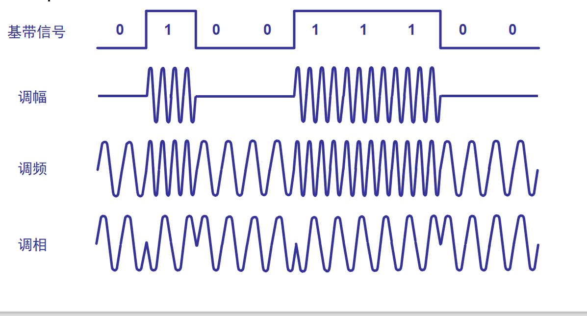