[TOC]

# 3.数据链路层


**一些基本概念**

**数据链路层的信道**主要有以下两种类型：

- **点对点信道：**这种信道使用一对一的点对点通信方式。

- **广播信道：**这种信道使用一对多的广播通信方式，因此过程比较复杂。广播信道上连接的主机很多，因此必须使用专业的共享信道协议来协调这些主机的数据发送

**主机1向主机二发送数据**，数据从应用层向下流动，到达物理层变成比特流，经过路由器转发，通过检查MAC地址，查看IP地址，然后选择路由，找到下一个地址，再向下到物理层，这样经过路由器转发，到达H2。


而从数据链路层的角度来看，我们只需要关心协议栈中水平方向中的各个数据链路层，我们想象数据链路层是从左到右沿水平方向传输的。

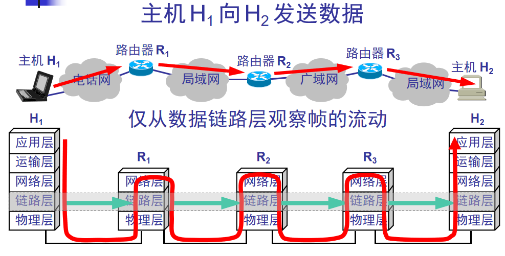

## 3.1  使用点对点信道的数据链路层

### 3.1.1 数据链路和帧

**数据链路层的模型和帧**

- 链路是一条无源的点到点的物理线路段，中间没有任何其他的交换节点
  - 一条链路只是一条通路的一个组成部分
- 数据链路：除了物理线路外，还必须有通信协议来控制这些数据的传输。若把实现这些协议的硬件和软件加到链路上，就构成了数据链路。
  - 现在最常用的方法是使用适配器（网卡）来实现这些协议的硬件和软件。
  - 一般的适配器都包括了数据链路层和物理层这两层的功能。
- 帧：在数据链路层上传送的就是帧

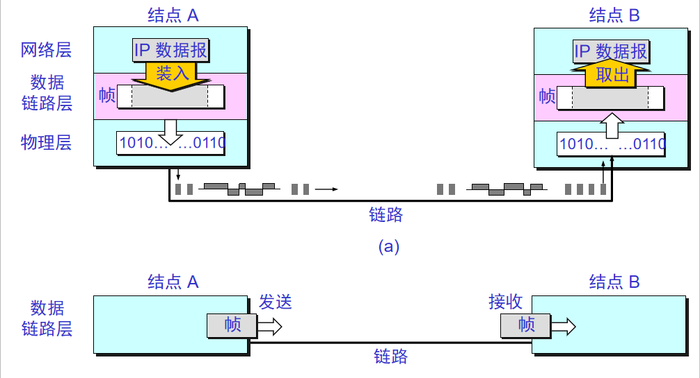

### 3.1.2 三个基本问题

#### 封装成帧

- 封装成帧就是在一段数据的前后分别添加首部和尾部，然后构成一个帧，确定帧的界限
- 首部和尾部的一个重要作用就是进行帧定界

> MTU  最大传送单元<=1500个字节


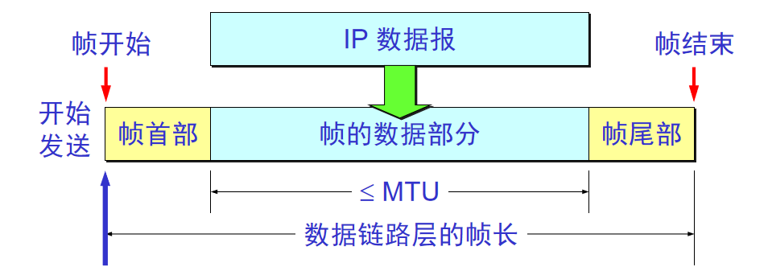

计算机在接受一个帧时，收到了帧的首部和尾部才能认为这个帧是一个完整的数据帧，若没有收到一个完整的数据帧，则认为他是不完整的，则会将其丢弃。

帧定界符

- 控制字符SOH（Start Of Header）：放在帧的最前面，表示帧的首部
- 控制字符EOT（End Of Transmission）：表示帧的结束

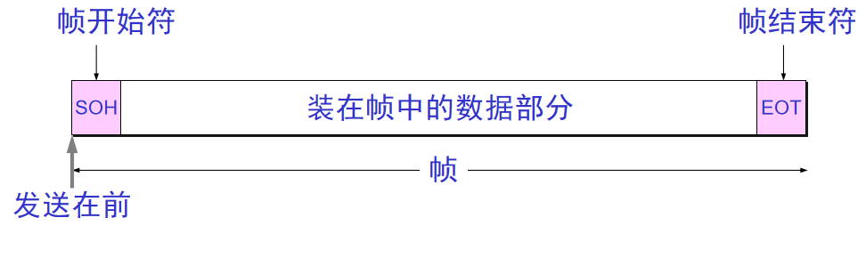

#### 透明传输

**问题**

在封装成帧后，我们传输的数据中如果在数据中间出现部分EOT或者SOH这样的帧定界控制字符时，可能会导致数据意外的被丢弃，这时我们需要透明传输。如图所示

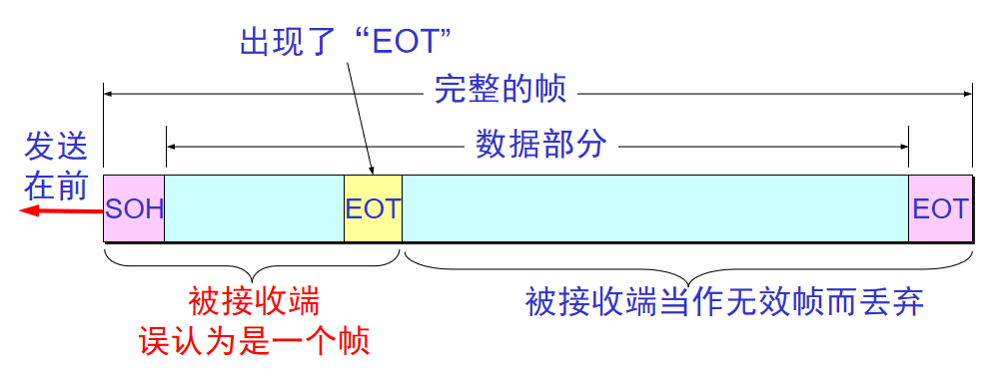

解决问题：**实现透明传输**

透明传输指数据中可能实际存在帧定界符，但是不被我们处理，就好像透明一样，我们采用的方法是在发送端的数据链路层在数据中长线**控制字符时**在前面插入转义字符**”ESC“**，

而在**接收端**的数据链路层在把数据传往网络层之前**删除插入的转义字符** 

如果转义字符也出现数据当中，那么应在**转义字符前面插入一个转义字符**。当**接收端**收到连续的两个转义字符时，就删除其中前面的一个。 


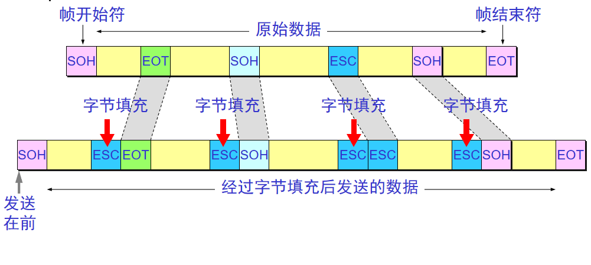

#### 差错控制

在传输过程中，可能会产生比特差错，1可能变成0，0可能变成1，在一段时间内传输错误他比特占所传输毕业总数的比率称为**误码率BER**。

数据链路层广泛使用**循环冗余检验CRC**：

1. 在发送端，先把数据划分为组。假定每组 k 个比特。
2. 假设待传送的一组数据 M = 101001（现在 k = 6）。我们在 M 的后面再添加供差错检测用的 n 位冗余码一起发送。  
3. 用二进制的模 2 运算进行 2的n次方 乘 M 的运算，这相当于在 M 后面添加 n 个 0（如n=3，M=101001000）。
4. 得到的 (k + n) 位的数除以事先选定好的长度为 (n + 1) 位的除数 P，得出商是 Q 而余数是 R，余数 R 比除数 P 少1 位，即 R 是 n 位。 
5. 在接收端接受到数据后，进行CRC校验，将发送端发送的数据除于余数R（异或运算），运算的**余数为0**则说明没有差错，就**接受**；如果余数R**不等于0，**就说明这个帧有差错就**丢弃**。

> 但这种检测方法并不能确定究竟是哪一个或哪几个比特出现了差错。
> 只要经过严格的挑选，并使用位数足够多的除数 P，那么出现检测不到的差错的概率就很小很小。 

**注意**

> 仅用循环冗余检验 CRC 差错检测技术只能做到**无差错接受(accept)。**
> “无差错接受”是指：“凡是接受的帧（即不包括丢弃的帧），我们都能以非常接近于 1 的概率认为这些帧在传输过程中没有产生差错”。
> 也就是说：“凡是接收端数据链路层接受的帧都没有传输差错”（有差错的帧就丢弃而不接受）。
> 要做到“可靠传输”（即发送什么就收到什么）就必须再加上确认和重传机制。  

例题：

- 现在 k = 6, M = 101001。
- 设 n = 3, 除数 P = 1101（除数n+1位）
- 被除数是 2nM = 101001000。 
- 模 2 运算的结果是：商 Q = 110101，余数 R = 001。
- 把余数 R 作为冗余码添加在数据 M 的后面发送出去。发送的数据是：2nM + R ，   即：101001001，共 (k + n) 位。 

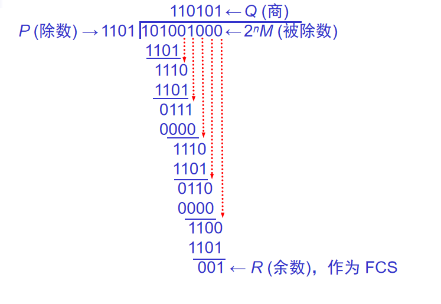

传送的数据为101001+余数R=101001001  接收端收到数据则使用该数据除于1101（P），余数为0，则无误，余数不为0，则说明传送过程中出错。

> 除数是由数据链路层的协议实现的，我们不用关心这个除数是多少和余数是

## 3.2  点对点协议 PPP (Point-to-Point Protocol)。

点对点协议PPP（Point-to-Point Protocol）是目前**使用最广泛**的数据链路层协议

### 		3.2.1 PPP 协议的特点

#### 1. PPP 协议应满足的需求 

- 简单——这是首要的要求
- 封装成帧 
- 透明性 
- 多种网络层协议 
- 多种类型链路 
- 差错检测 
- 检测连接状态 
- 最大传送单元 
- 网络层地址协商 
- 数据压缩协商  

#### 2. PPP 协议不需要的功能

- 纠错 
- 流量控制 
- 序号 
- 多点线路 
- 半双工或单工链路 

#### 3.  PPP 协议的组成

ppp协议由三个部分组成

1. 一个将 IP 数据报封装到串行链路的方法。
2. 链路控制协议 LCP (Link Control Protocol)。
3. 网络控制协议 NCP (Network Control Protocol)。   

### 		3.2.2 PPP 协议的帧格式

PPP帧的首部和尾部分别有四个字段和两个字段

- 首部的第一个字段和尾部第二个字段是标志字段F=0x7E(0111 1110)
- 地址字段地址字段 A 只置为 0xFF。地址字段实际上并不起作用。控制字段 C 通常置为 0x03。

协议字段：

- 当协议字段为 0x0021 时，PPP 帧的信息字段就是IP 数据报。
- 若为 0xC021, 则信息字段是 PPP 链路控制数据。
- 若为 0x8021，则表示这是网络控制数据。  

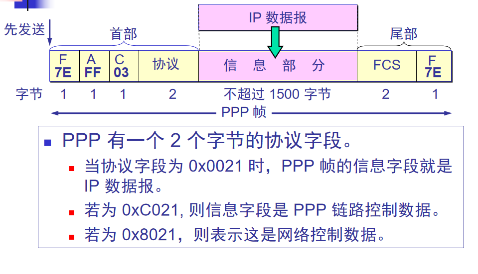

**PPP帧实现透明传输问题：**

1. 字节填充
   1. 当信息部分出现了0x7E时，将0x7E变成2字节的序列（0x7D,0x5E)
   2. 若信息部分出现了0x7D字节时，将其变为2字节的序列（0x7D,0x5D）
   3. 若信息部分出现了ASCII码的控制字符（即数值小于0x20的字符），则在字符前面要加入一个0x7D字节，同时将该字符的编码加以改变。
2. 零比特填充
   1. PPP 协议用在 SONET/SDH 链路时，是使用同步传输（一连串的比特连续传送，不是字节）。这时 PPP 协议采用零比特填充方法来实现透明传输。
   2. 在发送端，只要发现有 5 个连续 1，则立即填入一个 0。接收端对帧中的比特流进行扫描。每当发现 5 个连续1时，就把这 5 个连续 1 后的一个 0 删除，

 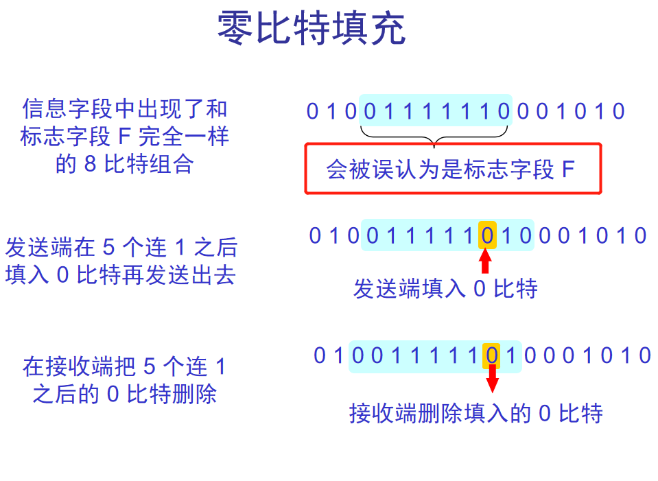

PPP 协议之所以**不使用序号和确认机制**是出于以下的考虑：

- 在数据链路层出现差错的概率不大时，使用比较简单的 PPP 协议较为合理。
- 在因特网环境下，PPP 的信息字段放入的数据是 IP 数据报。数据链路层的可靠传输并不能够保证网络层的传输也是可靠的。
- 帧检验序列 FCS 字段可保证无差错接受

### 		3.2.3 PPP 协议的工作状态

- 当用户拨号接入 ISP 时，路由器的调制解调器对拨号做出确认，并建立一条物理连接。
- PC 机向路由器发送一系列的 LCP 分组（封装成多个 PPP 帧）。
- 这些分组及其响应选择一些 PPP 参数，和进行网络层配置，NCP 给新接入的 PC机分配一个临时的 IP 地址，使 PC 机成为因特网上的一个主机。
- 通信完毕时，NCP 释放网络层连接，收回原来分配出去的 IP 地址。接着，LCP 释放数据链路层连接。最后释放的是物理层的连接。    

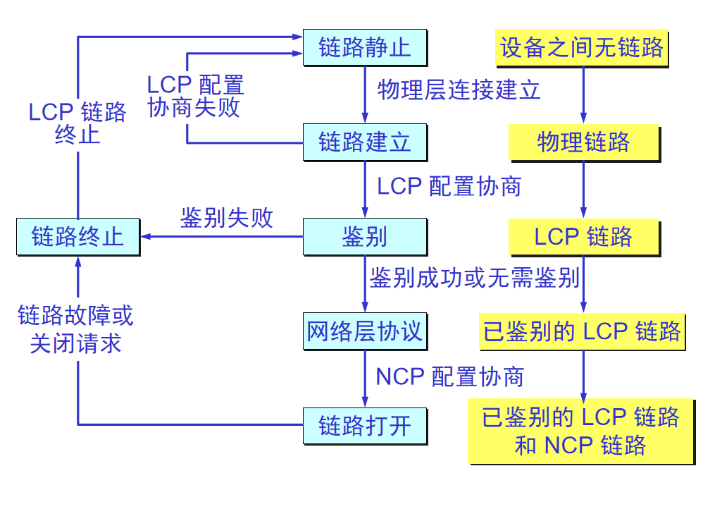


## 3.3  使用广播信道的数据链路层

### 	    3.3.1 局域网的数据链路层

#### 局域网

**局域网最主要的特点是：网络为一个单位所拥有，且地理范围和站点数目均有限。** 

**局域网具有如下的一些主要优点：**

1. 具有广播功能，从一个站点可很方便地访问全网。局域网上的主机可共享连接在局域网上的各种硬件和软件资源。 
2. 便于系统的扩展和逐渐地演变，各设备的位置可灵活调整和改变。
3. 提高了系统的可靠性、可用性和残存性。

**局域网的网络拓扑**

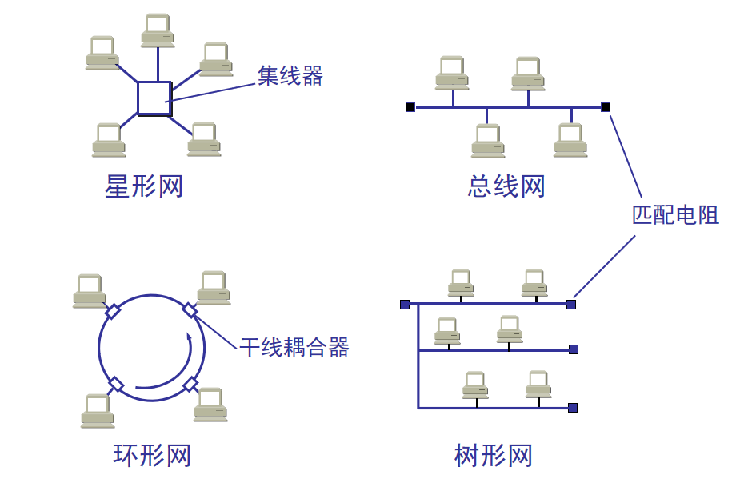

#### 适配器

网络接口板又称为通信适配器（adapter）或网络接口卡NIC（Network Interface Card）或网卡。
功能：

- 进行数据串行传输和并行传输的转换
- 对数据进行缓存
- 在计算机的操作系统中安装设备驱动程序
- 实现以太网协议

#### 数据链路层的两个子层

- 为了使数据链路层能更好地适应多种局域网标准，802 委员会就将局域网的数据链路层拆成两个子层：
  - 逻辑链路控制 LLC (Logical Link Control)
  - 子层媒体接入控制 MAC (Medium Access Control)子层。
- 与接入到传输媒体有关的内容都放在 MAC子层，而 LLC 子层则与传输媒体无关，不管采用何种协议的局域网对 LLC 子层来说都是透明的 

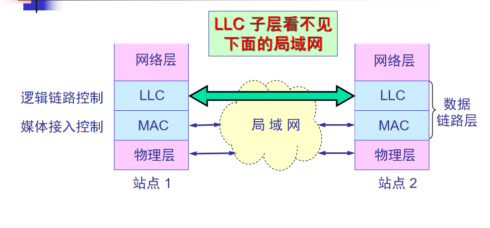

> 由于 TCP/IP 体系经常使用的局域网是 DIX Ethernet V2 而不是 802.3 标准中的几种局域网，因此现在 802 委员会制定的逻辑链路控制子层 LLC（即 802.2 标准）的作用已经不大了。
> 很多厂商生产的适配器上就仅装有 MAC 协议而没有 LLC 协议。 

### 	    3.3.2 CSMA/CD 协议

#### 载波监听多点接入/碰撞检测  CSMA/CD 

- **CSMA/CD 表示 Carrier Sense Multiple Access with Collision Detection。**
- “**多点接入**”表示许多计算机以多点接入的方式连接在一根总线上。
- “**载波监听**”是指每一个站在发送数据之前先要检测一下总线上是否有其他计算机在发送数据，如果有，则暂时不要发送数据，以免发生碰撞。 
- 总线上并没有什么“载波”。因此， “载波监听”就是用电子技术检测总线上有没有其他计算机发送的数据信号。  

#### 碰撞检测

- **“碰撞检测”**就是计算机边发送数据边检测信道上的信号电压大小。
- 当几个站同时在总线上发送数据时，总线上的信号电压摆动值将会**增大**（互相叠加）。
- 当一个站检测到的信号电压摆动值**超过一定的门限值时**，就认为总线上至少有两个站同时在发送数据，表明产生了**碰撞。**
- 所谓“碰撞”就是发生了冲突。因此“碰撞检测”也称为**“冲突检测”。**

**检测到碰撞后**

在发生碰撞时，总线上传输的信号产生了**严重的失真**，无法从中恢复出有用的信息来。每一个正在发送数据的站，一旦发现总线上出现了碰撞，就要立即**停止发送**，免得继续浪费网络资源，然后等待一段随机时间后**再次发送。**

**电磁波在总线上的有限传播速率的影响** 

当某个站监听到总线是空闲时，也可能总线并非真正是空闲的。 
A 向 B 发出的信息，要经过一定的时间后才能传送到 B。
B 若在 A 发送的信息到达 B 之前发送自己的帧(因为这时 B 的载波监听检测不到 A 所发送的信息)，则必然要在某个时间和 A 发送的帧发生碰撞。
碰撞的结果是两个帧都变得无用。  

如图所示，电磁波在1KM电缆的传播时延为5us，单程端到端的传播时延为τ，从图中可知，判断是否发送碰撞的时间**最多为2τ**

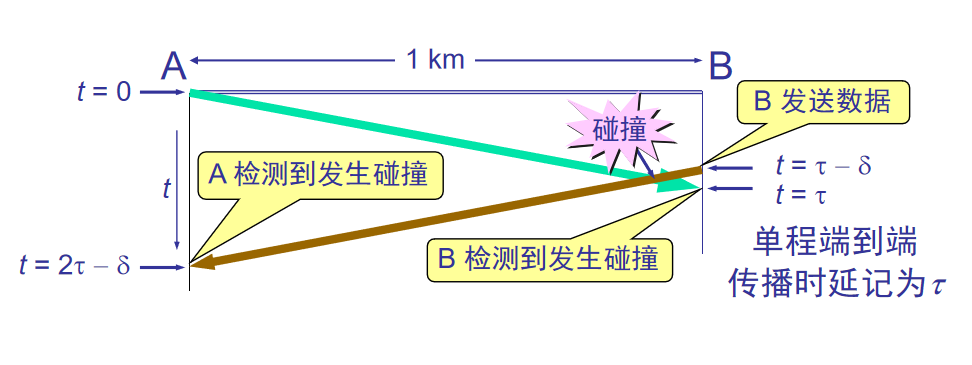

>  在使用CSMA/CD协议时，一个站不能同时发送与接收信息（必须边发送边监听信道），因此以太网使用的是**半双工通信**。


#### 争用期与退避算法

最先发送数据帧的站，在发送数据帧后至多经过时间 2τ（两倍的端到端往返时延）就可知道发送的数据帧是否遭受了碰撞。以太网的端到端往返时延 2τ 称为**争用期**，或碰撞窗口。经过争用期这段时间还没有检测到碰撞，才能肯定这次发送不会发生碰撞。

对于10Mb/s的以太网，通常取 2τ也就是51.2微秒作为争用期的长度，在争用期内可以发送512bit，也就是64字节，以太网发送数据时如果64字节未发生冲突，则后续的数据也不会发生冲突，因此以太网有规定**最短的有效帧的长度**

**最短有效帧长**

- 如果发生冲突，就一定时在发送前64字节之内
- 由于一检测到冲突就立即停止发送，这时已经发出去的数据一定时64字节
- 以太网规定了最短有效帧长度为64字节，但凡小于64字节的帧长度是由于冲突异常而中止的无效帧。

**截止二进制指数退避算法**

发生碰撞的站在停止发送数据后，要推迟退避一个随机时间才能再发送数据。

- 确定基本退避时间，一般是取为争用期 2τ。
- 定义重传次数 k ，k <= 10，即k = Min[重传次数, 10]
- 从整数集合[0,1,…, (2k −1)]中随机地取出一个数，记为 r。重传所需的时延就是 r 倍的基本退避时间。
- 当重传达 16 次仍不能成功时即丢弃该帧，并向高层报告

**强化碰撞**

当发送数据的站一旦发现发生了碰撞时：

- 立即停止发送数据；
- 再继续发送若干比特（32或48比特）的人为干扰信号(jamming signal)，以便让所有用户都知道现在已经发生了碰撞。

## 3.4  使用广播信道的以太网

**以太网的两个标准：**

- DIX Ethernet V2：世界上第一个局域网产品的规约
- IEEE 802.3：第一个IEEE的以太网标准

以太网严格来说，是指符合DIX Ethernet V2标准打的局域网
IEEE802委员会把局域网数据链路层拆成两个子层，即**逻辑链路控制LLC子层**和**媒体接入控制MAC子层**。与接入到传输媒体相关的内容都放在MAC子层上，而LLC子层与传输媒体无关，不管采用何种协议的局域网对LLC子层来说都是透明的。

- 以太网提供的服务是不可靠的交付，即尽最大努力的交付。
- 当目的站收到有差错的数据帧时就丢弃此帧，其他什么也不做。差错的纠正由高层来决定。
- 如果高层发现丢失了一些数据而进行重传，但以太网并不知道这是一个重传的帧，而是当作一个新的数据帧来发送。

以太网发送的数据都使用曼彻斯特编码

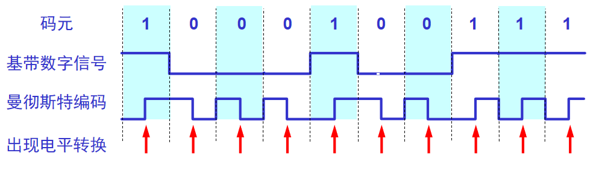

以太网的共享信道划分
**静态划分信道**：频分复用、时分复用波分复用和玛分复用等，这种方式不适合局域网。
**动态媒体接入控制**（多点接入）：

- 随机接入
- 受控接入 如多点线路探询或轮询

###        3.4.1  使用集线器的星形拓扑

物理上是星型，逻辑上是总线型。
为了降低成本，最初由粗的同轴电缆变成细的**同轴电缆**最后变成**无屏蔽双绞线**。每个站需要用两对双绞线，分别用于发送和接收；
在星形的中心增加了一种可靠性高的设备，为集线器(hub)。

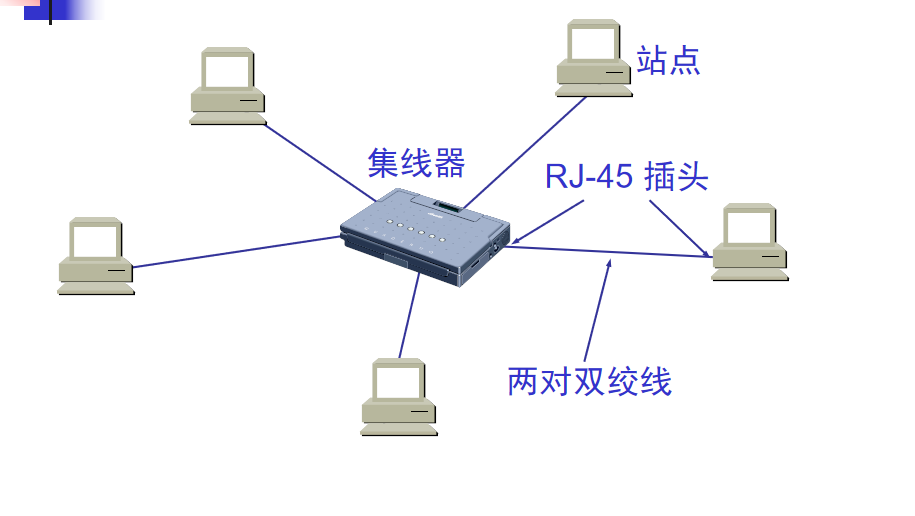

#### 集线器的特点

- 集线器是使用电子器件来模拟实际电缆线的工作，因此整个系统仍然像一个传统的以太网那样运行。 
- 使用集线器的以太网在逻辑上仍是一个总线网，各工作站使用的还是 CSMA/CD 协议，并共享逻辑上的总线。 
- 集线器很像一个多接口的转发器，工作在物理层。 

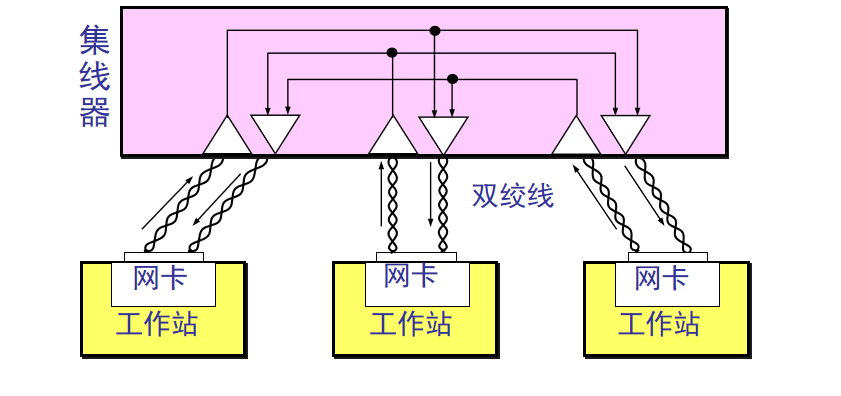

#### 10Base-T 基于集线器的以太网标准

- 它的通信距离稍短，每个站到集线器的距离不超过100m。
- 这种10MB/s的无屏蔽双绞线星形网的出现，能降低成本和提高可靠性。
- 10Base-T的出现有很大的意义，类似标准有100Base-FX，10Base-T，100Base-T4.

#### 以太网在局域网中的统治地位

- 10BASE-T 的通信距离稍短，每个站到集线器的距离不超过 100 m。
- 这种 10 Mb/s 速率的无屏蔽双绞线星形网的出现，既降低了成本，又提高了可靠性。 
- 10BASE-T 双绞线以太网的出现，是局域网发展史上的一个非常重要的里程碑，它为以太网在局域网中的统治地位奠定了牢固的基础。 

 ### 3.4.2  以太网的信道利用率 

以太网的信道被占用的情况：
争用期长度为 2t，即端到端传播时延的两倍。检测到碰撞后不发送干扰信号。
帧长为 L (bit)，数据发送速率为 C (b/s)，因而帧的发送时间为 L/C = T0 (s)。

一个帧从开始发送，经可能发生的碰撞后，将再重传数次，到发送成功且信道转为空闲(即再经过时间 t 使得信道上无信号在传播)时为止，是发送一帧所需的平均时间。

 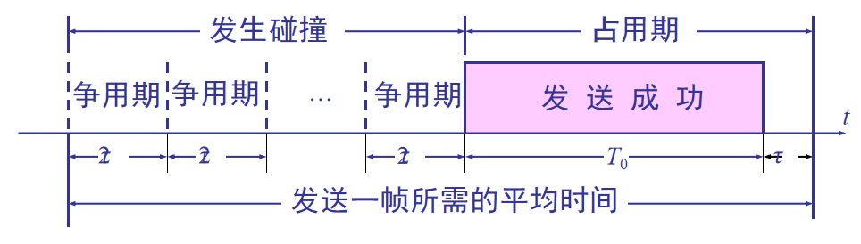

定义信道利用率a=t/T0,是单纯端到端时延t和帧发送时间T0的比值

- a→0 表示一发生碰撞就立即可以检测出来，
     并立即停止发送，因而信道利用率很高。
- a 越大，表明争用期所占的比例增大，每发
     生一次碰撞就浪费许多信道资源，使得信道
     利用率明显降低。 
- 在理想状态下，发送一针需要T0+t的时间，所以理想状态下，极限信道的利用率**Amax=T0/（T0+t）=1/（1+a）**，也就是帧发送时间和检测碰撞的时间

 ### 3.4.3  以太网的 MAC 层

​	在局域网中，**硬件地址**又称为**物理地址**，或者**MAC地址**

IEEE 的注册管理机构 RA 负责向厂家分配地址字段的前三个字节(即高位 24 位)。

地址字段中的后三个字节(即低位 24 位)由厂家自行指派，称为扩展标识符，必须保证生产出的适配器没有重复地址。一个地址块可以生成224个不同的地址。这种 48 位地址称为 MAC-48，它的通用名称是EUI-48。“MAC地址”实际上就是适配器地址或适配器标识符EUI-48。

查看本机的MAC地址

```commonlisp
ipconfig  /all   如下图的物理地址
```

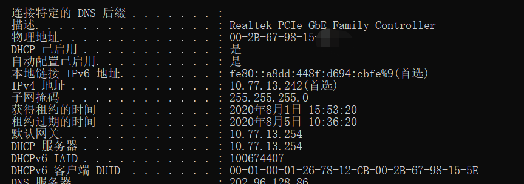

**适配器检查 MAC 地址 **

- 适配器从网络上每收到一个 MAC 帧就首先用硬件检查 MAC 帧中的 MAC 地址.
  - 如果是发往本站的帧则收下，然后再进行其他的处理。
  - 否则就将此帧丢弃，不再进行其他的处理。
- “发往本站的帧”包括以下三种帧： 
  - 单播(unicast)帧（一对一）
  - 广播(broadcast)帧（一对全体）
  - 多播(multicast)帧（一对多）

**MAC帧格式**

常用的以太网MAC帧格式有两种标准 ：

- DIX Ethernet V2 标准
- IEEE 的 802.3 标准

最常用的 MAC 帧是以太网 V2 的格式。

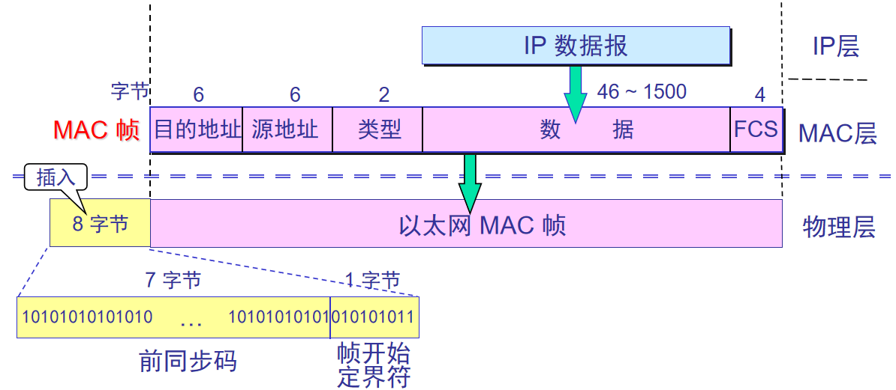

由于以太网要求帧长度最小为64字节，所以数据部分最小长度为46字节（64-6-6-4-2）

类型两个字节，指明数据部分是什么协议。

由于以太网使用的是**曼彻斯特编码**，在帧开始部分插入帧开始的标志符，结尾无信号则表示传输结束。在帧的前面插入的 8 字节中的第一个字段共 7 个字节，是**前同步码**，用来迅速实现 MAC 帧的**比特同步**。第二个字段是**帧开始定界符**，表示后面的信息就是**MAC 帧**


**使用WireShark抓包查看MAC地址**

笔主下载百度云的一个20Kb的小文件来进行抓包

如图为目的地址和本机的物理地址（可以参考上面查看本机的MAC地址），以及使用的类型：IPv4协议。

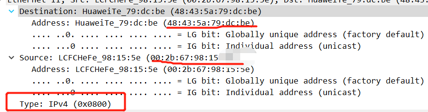


**无效的MAC帧**

- 数据字段的长度与长度字段的值不一致；
- 帧的长度不是整数个字节；
- 用收到的帧检验序列 FCS 查出有差错；
- 数据字段的长度不在 46 ~ 1500 字节之间。
- 有效的 MAC 帧长度为 64 ~ 1518 字节之间。
- 对于检查出的无效 MAC 帧就简单地丢弃。以太网不负责重传丢弃的帧。 

**帧间最小间隔**

- 帧间最小间隔为 9.6 us，相当于 96 bit 的发送时间。
- 一个站在检测到总线开始空闲后，还要等待 9.6 s 才能再次发送数据。
- 这样做是为了使刚刚收到数据帧的站的接收缓存来得及清理，做好接收下一帧的准备。 

## 3.5 扩展的以太网

### 3.5.1  在物理层扩展以太网

- **主机使用光纤和一对光纤调制解调器连接到集线器** 

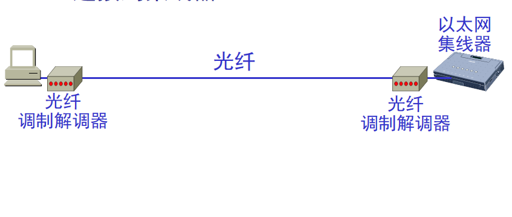

- **用多个集线器可连成更大的局域网**

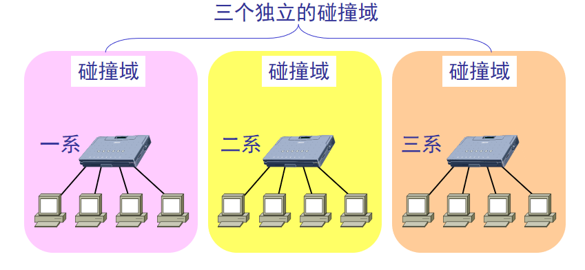


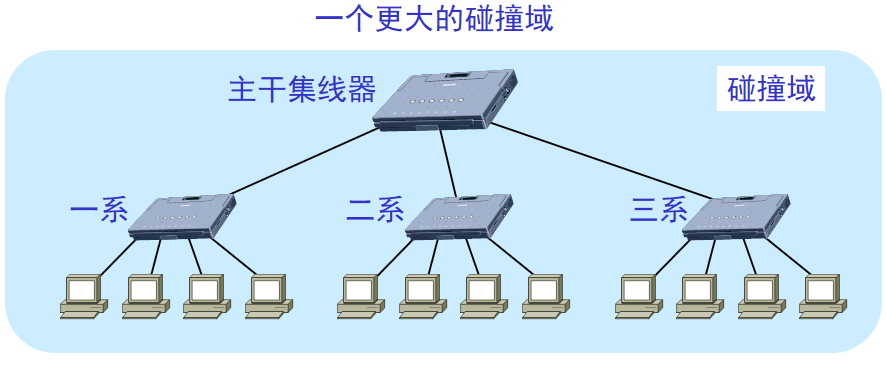

**用集线器扩展局域网** 

**优点**

 - 使原来属于不同碰撞域的局域网上的计算机能够进行跨碰撞域的通信。
 - 扩大了局域网覆盖的地理范围。

**缺点**

- 碰撞域增大了，但总的吞吐量并未提高。
- 如果不同的碰撞域使用不同的数据率，那么就不能用集线器将它们互连起来。  

###  3.5.2  在数据链路层扩展以太网

#### 网桥

在数据链路层扩展局域网是**使用网桥**。

- 网桥工作在数据链路层，它根据 MAC 帧的目的地址对收到的帧进行转发。
- 网桥具有过滤帧的功能。当网桥收到一个帧时，并不是向所有的接口转发此帧，而是先检查此帧的目的 MAC 地址，然后再确定将该帧转发到哪一个接口 

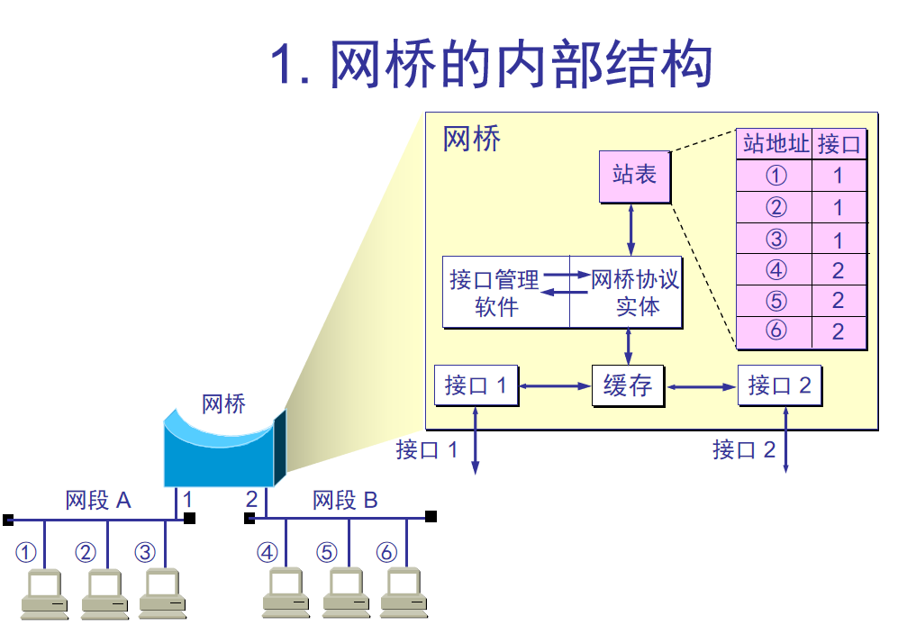

**网桥使各网段成为隔离开的碰撞域** 

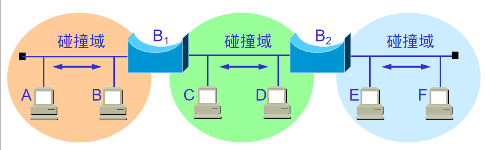

#### 网桥的优点与缺点

**使用网桥带来的好处** 

- 过滤通信量。 
- 扩大了物理范围。
- 提高了可靠性。
- 可互连不同物理层、不同 MAC 子层和不同速率（如10 Mb/s 和 100 Mb/s 以太网）的局域网。  

**使用网桥带来的缺点**

- 存储转发增加了时延。 (存储转发)
- 在MAC 子层并没有流量控制功能。 
- 具有不同 MAC 子层的网段桥接在一起时时延更大。
- 网桥只适合于用户数不太多(不超过几百个)和通信量不太大的局域网，否则有时还会因传播过的广播信息而产生网络拥塞。这就是所谓的**广播风暴**。

网桥与集线器（转发器）的区别

- 集线器在转发帧时，不对传输媒体进行检测。
- 网桥在转发帧之前必须执行 CSMA/CD 算法。
  - 若在发送过程中出现碰撞，就必须停止发送和进行退避。

#### 透明网桥

- 目前使用得最多的网桥是透明网桥(transparent bridge)。 
- “透明”是指局域网上的站点并不知道所发送的帧将经过哪几个网桥，因为网桥对各站来说是看不见的。 
- 透明网桥是一种即插即用设备，其标准是 IEEE 802.1D。 

#### 网桥的自学习算法

- 若从 A 发出的帧从接口 x 进入了某网桥，那么从这个接口出发沿相反方向一定可把一个帧传送到 A。
- 网桥每收到一个帧，就记下其源地址和进入网桥的接口，作为转发表中的一个项目。
- 在建立转发表时是把帧首部中的源地址写在“地址”这一栏的下面。
- 在转发帧时，则是根据收到的帧首部中的目的地址来转发的。这时就把在“地址”栏下面已经记下的源地址当作目的地址，而把记下的进入接口当作转发接口。


#### 网桥的自学习和转发帧的步骤归纳 

1. 在网桥的转发表中写入的信息除了**地址和接口**外，还有帧进入该网桥的**时间**。
2. 这是因为以太网的拓扑可能经常会发生变化，站点也可能会更换适配器（这就改变了站点的地址）。另外，以太网上的工作站并非总是接通电源的。
3. 把每个帧到达网桥的时间登记下来，就可以在转发表中只保留网络拓扑的**最新状态信息**。这样就使得网桥中的转发表能反映当前网络的最新拓扑状态。 
4. **网桥收到一帧后先进行自学习**。查找转发表中与收到帧的源地址有无相匹配的项目。如没有，就在转发表中增加一个项目（源地址、进入的接口和时间）。如有，则把原有的项目进行更新。
5. 转发帧。查找转发表中与收到帧的目的地址有无相匹配的项目。
   1. 如没有，则通过所有其他接口（但进入网桥的接口除外）按进行转发。
   2. 如有，则按转发表中给出的接口进行转发。
   3. 若转发表中给出的接口就是该帧进入网桥的接口，则应丢弃这个帧（因为这时不需要经过网桥进行转发）。


#### 转发表的建立过程举例：


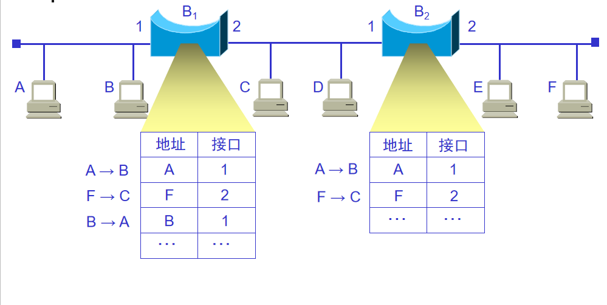

#### 生成树算法

透明网桥使用了生成树算法，这是为了避免产生转发的帧在网络中不断地兜圈子。 

**生成树的得出**

- 互连在一起的网桥在进行彼此通信后，就能找出原来的网络拓扑的一个子集。在这个子集里，整个连通的网络中不存在回路，即**在任何两个站之间只有一条路径。** 
- 为了避免产生转发的帧在网络中不断地兜圈子。
- 为了得出能够反映网络拓扑发生变化时的生成树，在生成树上的根网桥每隔一段时间还要对生成树的拓扑进行更新。  

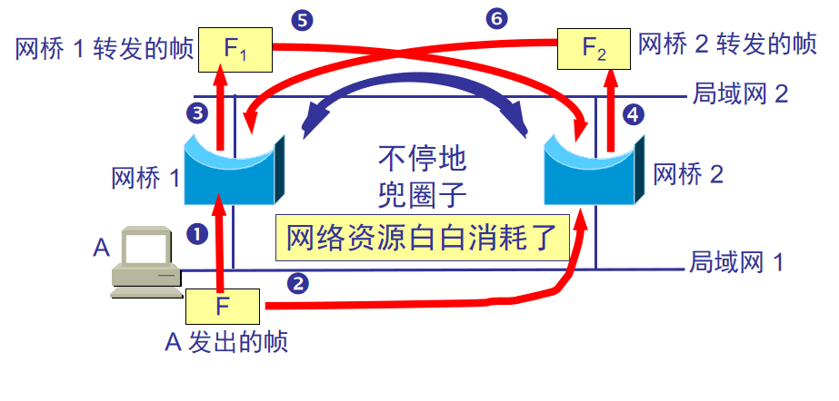

#### 交换机

随着网桥的接口的增加， 后来网桥和集线器合并了，计算机可以直接和交换机连接，这就是交换机。交换机就是网桥和集线器的合并升级版，能全双工，安全通信。端口带宽独享；

#### 交换节的特点

- 以太网交换机的每个接口都直接与主机相连，并且一般都工作在**全双工方式。**
- 交换机能同时连通许多对的接口，使每一对相互通信的主机都能像独占通信媒体那样，进行**无碰撞地传输数据**。 
- 以太网交换机由于使用了专用的交换结构芯片，其交换速率就较高。    
- **独占传输媒体的带宽** 
  - 对于普通 10 Mb/s 的共享式以太网，若共有 N 个用户，则每个用户占有的平均带宽只有总带宽(10 Mb/s)的 N 分之一。
  - 使用以太网交换机时，虽然在每个接口到主机的带宽还是 10 Mb/s，但由于一个用户在通信时是**独占**而不是和其他网络用户共享传输媒体的带宽，因此对于拥有 N 对接口的交换机的总容量为 N=10 Mb/s。这正是交换机的最大优点。 

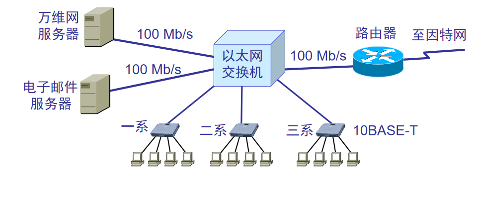

### 3.5.3 虚拟局域网（VLAN）

虚拟局域网VLAN是由一些局域网网段构成的与物理位置无关的逻辑组，虚拟局域网其实知识局域网给用户提供的一种服务，并不是一种新型的局域网。**利用以太网交换机可以很方便地实现虚拟局域网** 

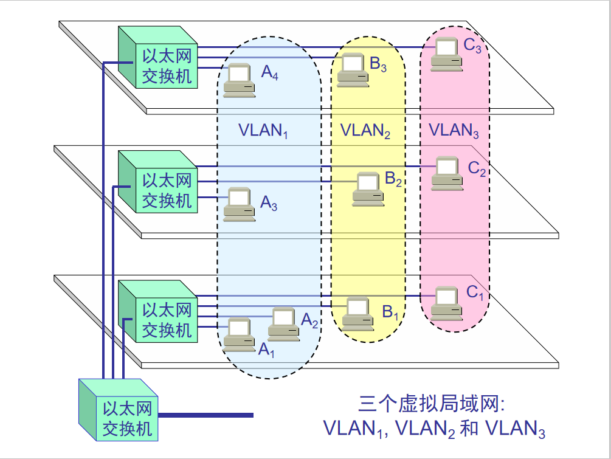

如图

当 B1 向 VLAN2 工作组内成员发送数据时，工作站 B2 和 B3 将会收到广播的信息。

B1 发送数据时，工作站 A1, A2 和 C1都不会收到 B1 发出的广播信息。 

虚拟局域网限制了接收广播信息的工作站数，使得网络不会因传播过多的广播信息(即“广播风暴”)而引起性能恶化。 

**虚拟局域网使用的以太网帧格式**

虚拟局域网协议允许在以太网的帧格式中插入一个 4 字节的标识符，称为 VLAN 标记(tag)，用来指明发送该帧的工作站属于哪一个虚拟局域网。 

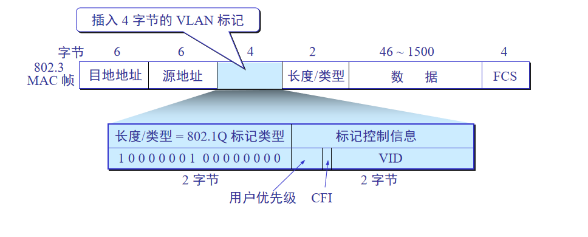

## 3.6 高速以太网

 ### 3.6.1  100BASE-T 以太网

- 速率达到或超过 100 Mb/s 的以太网称为高速以太网。
- 在双绞线上传送 100 Mb/s 基带信号的星型拓扑以太网，仍使用 IEEE 802.3 的CSMA/CD 协议。100BASE-T 以太网又称为快速以太网(Fast Ethernet)。 

#### 100BASE-T 以太网的特点

- 可在全双工方式下工作而无冲突发生。因此，不使用 CSMA/CD 协议。
- MAC 帧格式仍然是 802.3 标准规定的。
- 保持最短帧长不变，但将一个网段的最大电缆长度减小到 100 m。
- 帧间时间间隔从原来的 9.6 us 改为现在的 0.96 us。

#### 三种不同的物理层标准 

- **100BASE-TX**
  - 使用 2 对 UTP 5 类线或屏蔽双绞线 STP。
- **100BASE-FX** 
  - 使用 2 对光纤。 
- **100BASE-T4**
  - 使用 4 对 UTP 3 类线或 5 类线。 

### 3.6.2  吉比特以太网

- 允许在 1 Gb/s 下全双工和半双工两种方式工作。
- 使用 802.3 协议规定的帧格式。
- 在半双工方式下使用 CSMA/CD 协议（全双工方式不需要使用 CSMA/CD 协议）。
- 与 10BASE-T 和 100BASE-T 技术向后兼容。

#### 吉比特以太网的物理层 

###   3.6.3  10 吉比特以太网

- 1000BASE-X      基于光纤通道的物理层：
  - 1000BASE-SX   SX表示短波长
  - 1000BASE-LX   LX表示长波长
  - 1000BASE-CX   CX表示铜线
- 1000BASE-T 
  - 使用 4对 5 类线 UTP 

#### 吉比特以太网的配置举例 

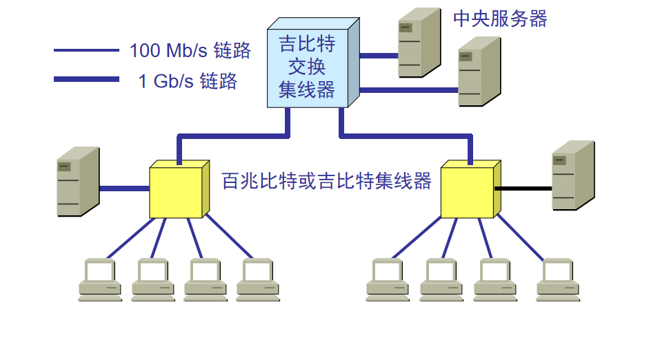

###   3.6.4  使用高速以太网进行宽带接入

- 以太网已成功地把速率提高到 1 ~ 10 Gb/s ，所覆盖的地理范围也扩展到了城域网和广域网，因此现在人们正在尝试使用以太网进行宽带接入。
- 以太网接入的重要特点是它可提供双向的宽带通信，并且可根据用户对带宽的需求灵活地进行带宽升级。
- 采用以太网接入可实现端到端的以太网传输，中间不需要再进行帧格式的转换。这就提高了数据的传输效率和降低了传输的成本。  

##    3.7  其他类型的高速局域网接口

### 3.7.1 10 吉比特以太网

- 10 吉比特以太网与 10 Mb/s，100 Mb/s 和 1 Gb/s 以太网的帧格式完全相同。
- 10 吉比特以太网还保留了 802.3 标准规定的以太网最小和最大帧长，便于升级。
- 10 吉比特以太网不再使用铜线而只使用光纤作为传输媒体。
- 10 吉比特以太网只工作在全双工方式，因此没有争用问题，也不使用 CSMA/CD 协议。    

### 3.7.2 吉比特以太网的物理层 

- 局域网物理层 LAN PHY。局域网物理层的数据率是 10.000 Gb/s。
- 可选的广域网物理层 WAN PHY。广域网物理层具有另一种数据率，这是为了和所谓的“Gb/s”的 SONET/SDH（即OC-192/STM-64）相连接。
  - 为了使 10 吉比特以太网的帧能够插入到 OC-192/STM-64 帧的有效载荷中，就要使用可选的广域网物理层，其数据率为 9.95328 Gb/s。   

### 3.7.3 端到端的以太网传输 

- 10 吉比特以太网的出现，以太网的工作范围已经从局域网（校园网、企业网）扩大到城域网和广域网，从而实现了端到端的以太网传输。
- 这种工作方式的好处是： 
  - 成熟的技术
  - 互操作性很好
  - 在广域网中使用以太网时价格便宜。
  - 统一的帧格式简化了操作和管理。     

### 3.7.4 以太网从 10 Mb/s 到10 Gb/s 的演进 

以太网从 10 Mb/s 到 10 Gb/s 的演进证明了以太网是：

- 可扩展的（从 10 Mb/s 到 10 Gb/s）。
- 灵活的（多种传输媒体、全/半双工、共享/交换）。
- 易于安装。
- 稳健性好。 

**以太网接入举例**

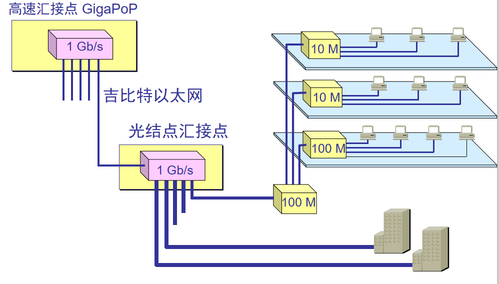