[TOC]

# 四、网络层

##  4.1  网络层提供的两种服务

### 4.1.1 虚电路服务

- 虚电路表示这只是一条逻辑上的连接，分组都沿着这条逻辑连接按照存储转发方式传送，而并不是真正建立了一条物理连接。
- 请注意，电路交换的电话通信是先建立了一条真正的连接。因此分组交换的虚连接和电路交换的连接只是类似，但并不完全一样。 

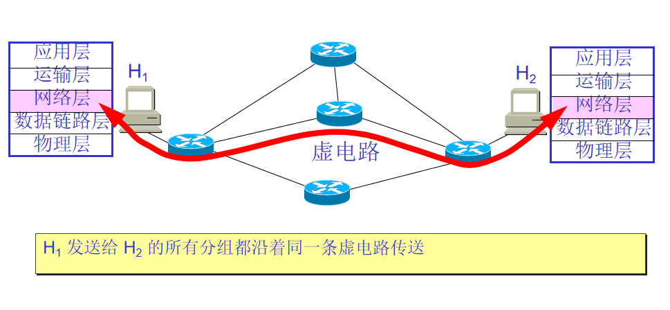

### 4.1.2 数据报服务

**因特网采用的设计思路**

- 网络层向上只提供**简单灵活的、无连接的、尽最大努力交付的**数据报服务。
- 网络在发送分组时**不需要先建立连接**。每一个分组（即 IP 数据报）独立发送，与其前后的分组无关（不进行编号）。
- 网络层**不提供服务质量**的承诺。即所传送的分组可能出错、丢失、重复和失序（不按序到达终点），当然也不保证分组传送的时限。 

**尽最大努力交付的好处**

- 由于传输网络不提供端到端的可靠传输服务，这就使网络中的路由器做的可以比较简单，而且价格低廉，节省成本。
- 如果主机中的进程之间的通信时需要可靠传输的，那么就由网络的主机中的运输层负责，（差错管理，和流量控制）
- 降低成本，运行方式灵活，能够适应多种应用。

如图，主机H1发送给主机H2的分组可以不同的路径传送数据报给H2.

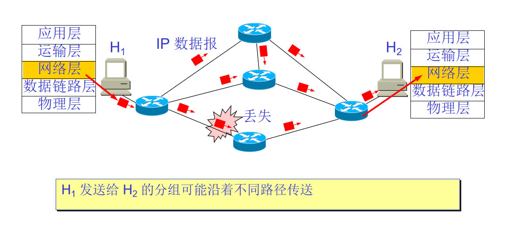

### 4.1.3 数据报服务和虚电路的比较

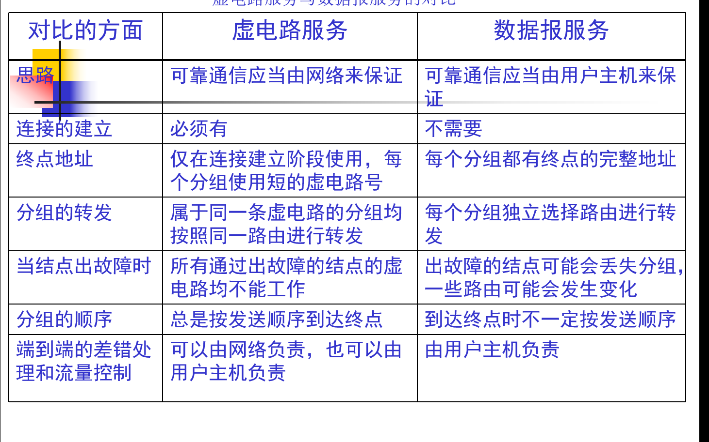


## 4.2  网际协议 IP

网际协议IP是TCP/IP体系中两个最主要的协议之一；与IP协议配套时延的还有四个协议：

1. 地址解析协议**ARP**（Address Resolution Protocol）
2. 逆地址解析协议**RARP**（Reverse Address Resolution Protocol）
3. 网络控制报文协议**ICMP**(Internet Group Management Protocol)
4. 网际组管理协议**IGMP**（Internet Group Management Protocol）


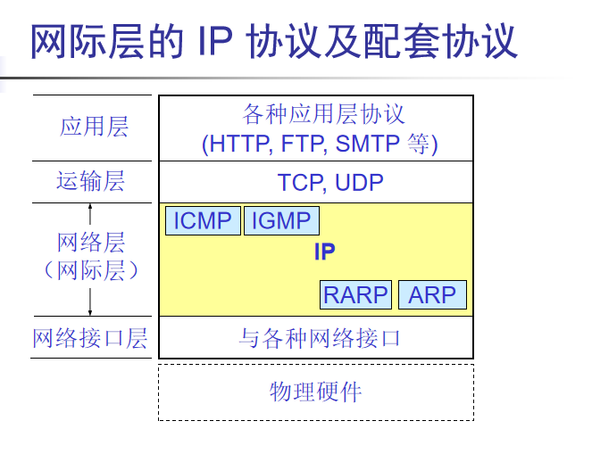

### 4.2.1  虚拟互连网络

**意义**

- 所谓虚拟互联网络也就是逻辑互联网络，它的意思就是互连起来的各种物理网络的异构性本来是客观存在的，但是我们利用IP协议就可以使这些性能各异的网络从用户看来就好像使一个统一的网络
- 使用了IP协议的虚拟互联网络可以简称为IP网。
- 使用虚拟互联网络的好处使：当互联网上的主机进行通信时，就好像时在一个网络上通信一样，而看不见互联的各个具体的网络异构细节。

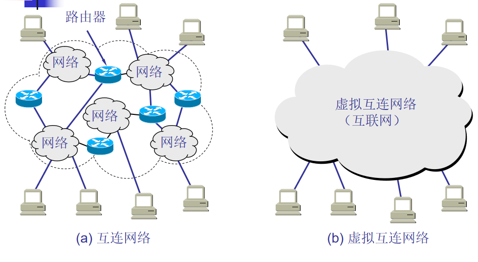


### 4.2.2  分类的 IP 地址	

​	IP地址就是每个连接因特网的主机（或者路由器）分配一个在全世界范围内是唯一的32位的标识符。IP 地址现在由**因特网名字与号码指派公司**ICANN (Internet Corporation for Assigned Names and Numbers)进行分配  。

​	 **IP地址的编址方法**

- 分类的 IP 地址。这是最基本的编址方法，在 1981 年就通过了相应的标准协议。
- 子网的划分。这是对最基本的编址方法的改进，其标准[RFC 950]在 1985 年通过。
- 构成超网。这是比较新的无分类编址方法。1993 年提出后很快就得到推广应用。

#### 分类 IP 地址 

- 每一类的地址都由两个固定长度的字段组成，其中一个字段是网络号（net-id），它标志主机或者路由器所连接到的网络，而另一个字段则是主机号（host-id），它标志着主机或者路由器	
- 两级的IP地址表示：IP地址::={<>网络号,<主机号>}

**IP 地址中的网络号字段和主机号字段** 

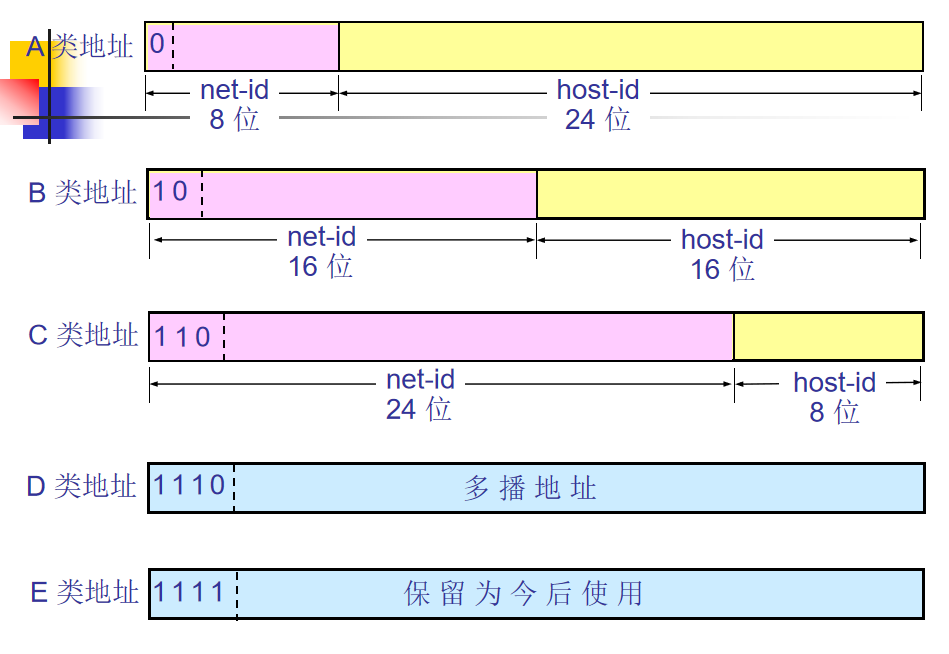

A类地址：0000 0000 - 0111 1111   0-127

B类地址：1000 0000 - 1011 1111 128-191

C类地址：1100 0000 - 1101 1111 192-223

D类地址：1110 0000 - 1110 1111 224 -239

E类地址：1111 0000 - 1111 1111 240-255

| 网络类别 | 最大网络数 | 第一个可用的网络号 | 最后一个可用的网络号 | 每个网络中最大的主机数 |
| -------- | ---------- | ------------------ | -------------------- | ---------------------- |
| A        | 126        | 1                  | 126                  | 256\*256*256=16777214  |
| B        | 16,383     | 128.1              | 191.255              | 65535                  |
| C        | 2097151    | 192.0.1            | 233.255.255          | 254                    |

 **几个特殊的地址**

127.0.0.1  本机环回地址 169.254.0.0 

保留的私网地址 

10.0.0.0 - 10.255.255.255

172.16.0.0 --- 172.31.255.255

192.168.0.0 - 192.168.255.255

### 4.2.3  IP 地址与硬件地址（MAC地址）


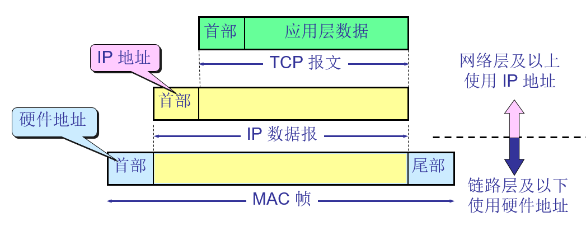

两个计算机之间的通信过程（从MAC帧和IP数据包的层面来看）

1. 交换机基于数据帧来转发地址，路由器基于数据包的IP地址来转发数据包
2. 数据包在传输过程中不变，过网络设备的数据帧要用新的物理地址来重新封装
3. MAC地址决定了下一条哪个设备接收，而IP地址决定了数据包的起点和终点


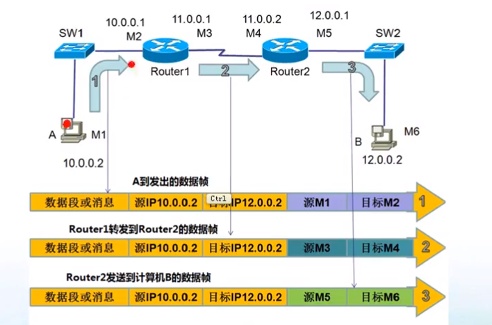


### 4.2.4  地址解析协议 ARP 与逆地址解析协议RARP

#### ARP协议

- 不管网络层使用的是什么协议，在实际网络的链路上传送数据帧时，最终还是必须使用硬件地址。 
- 每一个主机都设有一个 ARP 高速缓存(ARP cache)，里面有所在的局域网上的各主机和路由器的 IP 地址到硬件地址的映射表。
- 当主机 A 欲向本局域网上的某个主机 B 发送 IP 数据报时，就先在其 ARP 高速缓存中查看有无主机 B 的 IP 地址。如有，就可查出其对应的硬件地址，再将此硬件地址写入 MAC 帧，然后通过局域网将该 MAC 帧发往此硬件地址。 

ARP协议通过广播解析本网段的计算机MAC地址


#### 逆地址解析协议 RARP 

- 逆地址解析协议 RARP 使只知道自己硬件地址的主机能够知道其 IP 地址。

- 这种主机往往是无盘工作站。 因此 RARP协议目前已很少使用。 

### 4.2.5  IP 数据报的格式

一个IP数据报由首部和数据两部分组成，首部是的前一部分是固定长度，**共20字节**，是所有的IP数据包所必须具有的；在首部的固定部分的后面是一些可选字节，其长度是可变的。


#### IP数据包各个字段

- 版本：占4位，即IP协议的版本，目前的版本号为4，IPv4协议
- 首部字长：占4位，可表示的最大数值是15个单位（一个单位为4个字节），因此IP首部长度最大值为60字节。
- 区分服务：8位，用来获得更好的服务，来设置数据包传送的优先级，表示这个数据包发送的紧急程度（实时性要求）
- 总长度：占16位，首部和数据之和的长度，单位为字节，因此数据报的最大长度为65535个字节（2的16次方），总长度必须不超过最大传送单元MTU
- 标识：占 16 位，它是一个计数器，用来产生数据报的标识。
- 标志：占3位，目前只有前两位有意义，用来告诉数据包是否分片，MF=1表示还有分片，MF=0表示最后一个分片，但是标志的中间的DF=0时才允许分片
- 片位移：占12位，较长的分组在分片后，片位移以8字节为偏移单位

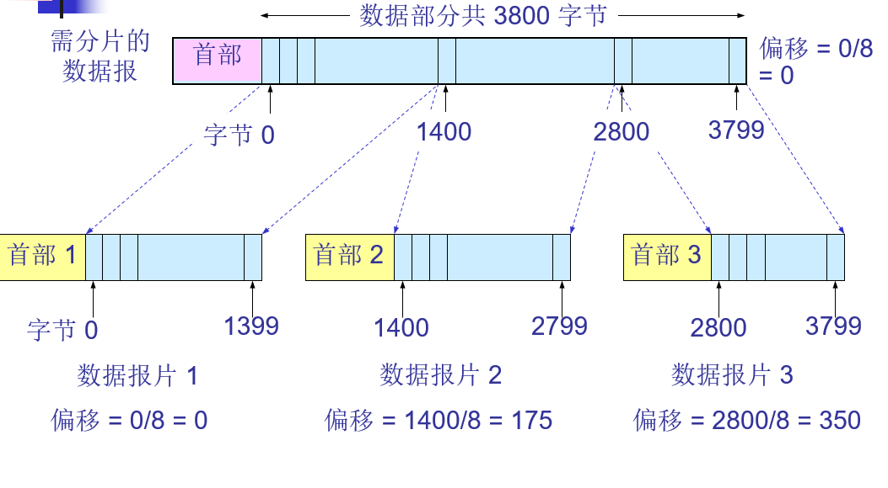

- 生存时间：占8位，记为TTL（Time to live）数据报在网络中可通过路由器数的最大值。Windows默认为128

如图ping本机的TTL为128

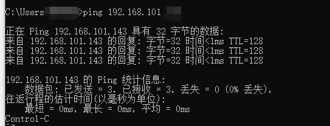

当我ping一下p站，TTL就54，说明经过了74个路由器。

想上p站学习的同学可以看下这个注册一下，一直在用，很稳定

https://www.cuuc.club//auth/register?code=UZ97

   								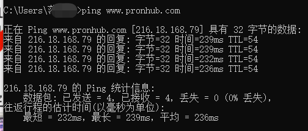 

- 协议：占8位，字段指出此数据报携带的数据使用何种协议，以便目的主机的 IP 层将数据部分上交给哪个处理过程

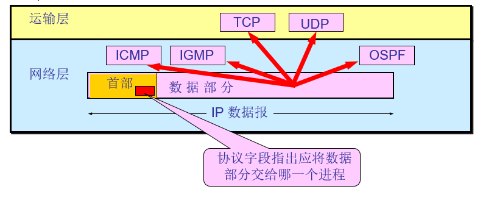

- 首部检验和(16 位)字段只检验数据报的首部，不检验数据部分。这里不采用 CRC 检验码而采用简单的计算方法。如下图为首部校验和的运算方法

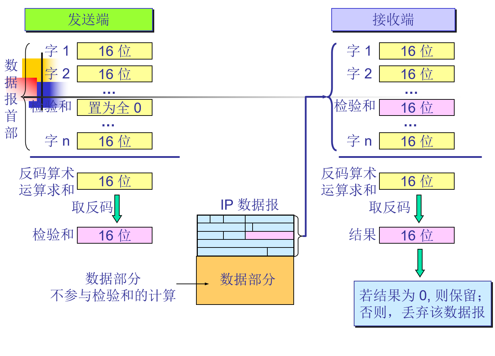

例子：

 **IP头：**

 45 00  00 31

 89 F5  00 00

 6E 06  00 00（校验字段）

 DE B7  45 5D    ->  222.183.69.93  (源IP地址)

 C0 A8  00 DC    ->  192.168.0.220 (目的IP地址)

 计算： 

 4500 + 0031 +89F5 + 0000 + 6e06+0000 + DEB7 + 455D + C0A8 + 00DC =3 22C4 （结果大于4bit,继续迭代计算)

 0003 + 22C4 = 22C7 

 ~22C7 = DD38   ->即为应填充的校验和

 当接受到IP数据包时，要检查IP头是否正确，则对IP头进行检验，方法同上：

 计算：

 4500 + 0031 +89F5 + 0000 + 6E06+DD38 + DEB7 + 455D + C0A8 + 00DC =3 FFFC

 0003 + FFFC = FFFF

 得到的结果是全1（取反为0），正确。


- 可变部分：n选项字段的长度可变，从 1 个字节到 40 个字节不等，取决于所选择的项目。n增加首部的可变部分是为了增加 IP 数据报的功能，但这同时也使得 IP 数据报的首部长度成为可变的。这就增加了每一个路由器处理数据报的开销。

#### 使用WireShark抓包分析

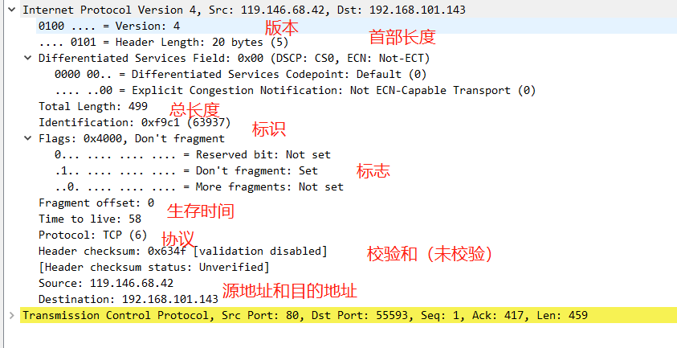

### 4.2.6  IP 层转发分组的流程

根据目的网络地址就能确定下一跳路由器，这样做的结果是：

- IP 数据报最终一定可以找到目的主机所在目的网络上的路由器（可能要通过多次的间接交付）。
-  只有到达最后一个路由器时，才试图向目的主机进行直接交付。


**分组转发算法**

(1) 从数据报的首部**提取目的主机的 IP 地址 *D***, 得出**目的网络地址为 *N***。

(2) 若网络 *N* **与此路由器直接相连**，则把数据报**直接交付**目的主机 *D*；否则是**间接交付**，执行(3)。

(3) 若路由表中有目的地址为 *D* 的特定主机路由，则把数据报传送给路由表中所指明的下一跳路由器；否则，执行(4)。

(4) 若路由表中有到达网络 *N* 的路由，则把数据报传送给路由表指明的下一跳路由器；否则，执行(5)。

(5) 若路由表中有一个**默认路由**，则把数据报传送给路由表中所指明的默认路由器；否则，执行(6)。

(6) 报告**转发分组出错**。 

**默认路由**

- 路由器还可采用默认路由以**减少路由表所占用的空间和搜索路由表所用的时间**。
- 这种转发方式在一个网络只有**很少的对外连接**时是很有用的。
- 默认路由在主机发送 IP 数据报时往往更能显示出它的好处。
- 如果一个主机连接在一个小网络上，而这个网络只用一个路由器和因特网连接，那么在这种情况下使用默认路由是非常合适的

## 4.3  划分子网和构造超网

### 4.3.1  划分子网

#### 划分子网的基本思路 

- 划分子网纯属一个单位内部的事情。单位对外仍然表现为没有划分子网的网络。
- 从主机号借用若干个位作为子网号 subnet-id，而主机号 host-id 也就相应减少了若干个位。

> IP地址 ::= {<网络号>, <子网号>, <主机号>} 

- B类地址，有两级结构，划分子网后变成了三级结构 
- 划分子网只是把 IP 地址的主机号 host-id 这部分进行再划分，而不改变 IP 地址原来的网络号 net-id。 

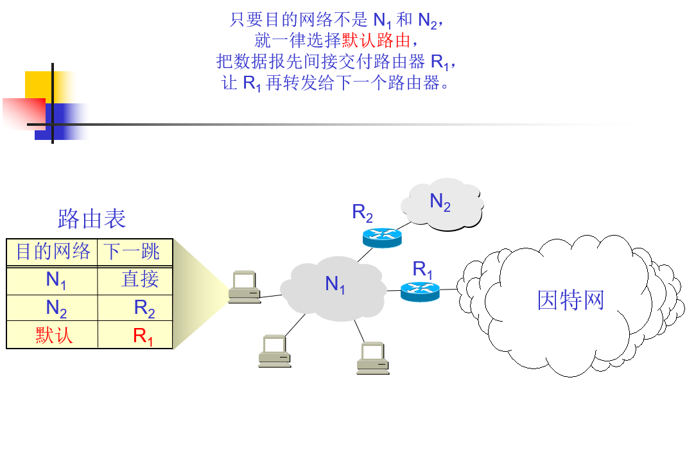


**添加静态路由**

Windows网关就是默认路由
查看Windows本地路由表

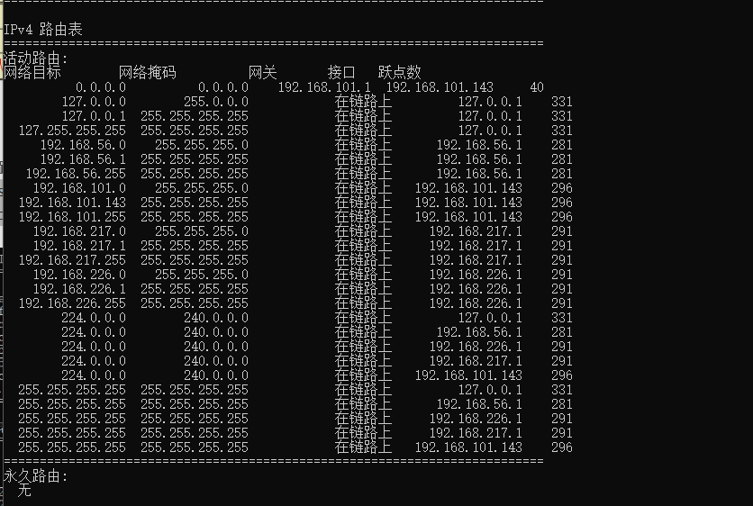


#### 子网掩码

​		从一个 IP 数据报的首部并无法判断源主机或目的主机所连接的网络是否进行了子网划分。使用子网掩码(subnet mask)可以找出 IP 地址中的子网部分。 

> (IP 地址) AND (子网掩码) =网络地址

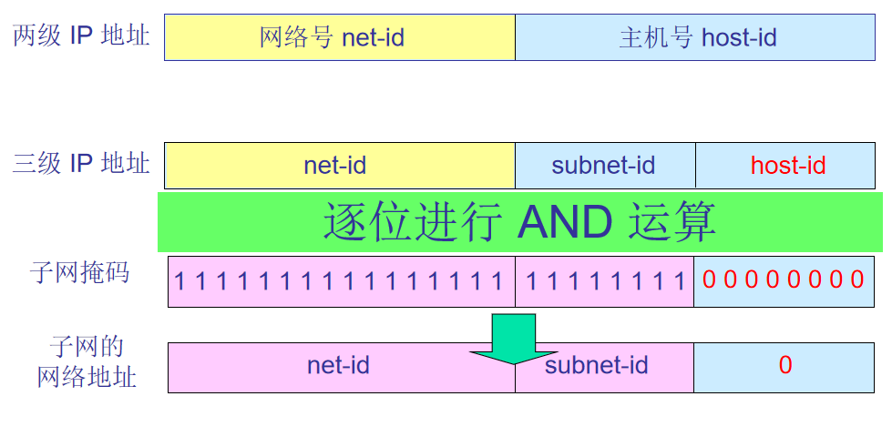

**默认子网掩码** 

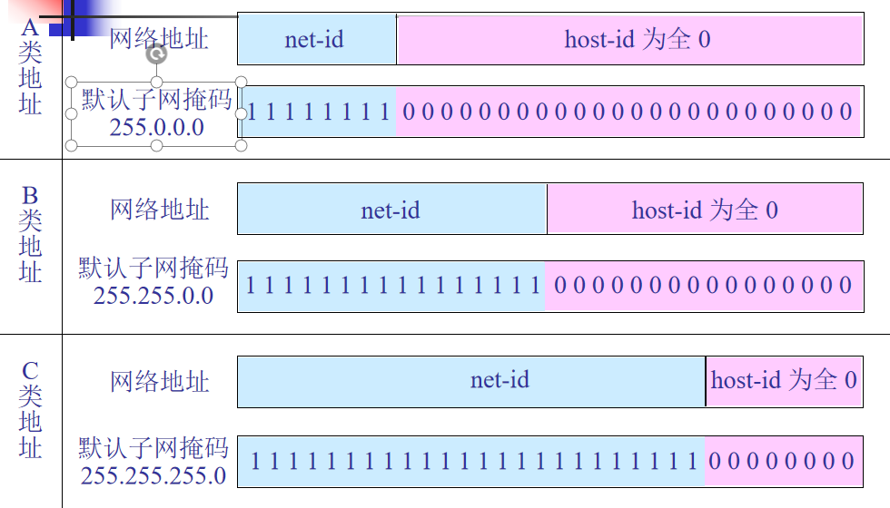

#### 对B类地址进行子网划分

对 172.16.0.0  进行划分成两个子网

| 子网一   | 172.16.0.1 - 172.16.127.254   |
| -------- | ----------------------------- |
| 子网二   | 172.16.128.1 - 172.16.255.254 |
| 子网掩码 | 255.255.128.0                 |

> **注意： 划分主机时，主机号不能全为0或者全为1**
>
> 使用点到点网络，子网掩码最好是252

#### 对C类地址进行等长子网划分

对192.168.0.0 255.255.255.0 这个C类地址分别进行等分2、4、8个子网

等分成两个子网   

| 192  | 168  | 0    | 0     | 000 0000 - 0111 1111 |
| ---- | ---- | ---- | ----- | -------------------- |
| 192  | 168  | 0    | **1** | 000 0000 - 1111 1111 |

可分配的主机号和划分的子网

| 192.168.0.1 - 192.168.0.126   |
| ----------------------------- |
| 192.168.0.128 - 192.168.0.254 |


子网掩码

| 1111 1111 | 1111 1111 | 1111 1111 | 1000 0000 |
| --------- | --------- | --------- | --------- |
| 255       | 255       | 255       | 128       |

等分成四个子网   拿出两位主机Id来进行划分

| 192  | 168  | 0    | **0**0 | 00 0000 - 0011 1111 |
| ---- | ---- | ---- | ------ | ------------------- |
| 192  | 168  | 0    | 01     | 00 0000 - 0111 1111 |
| 192  | 168  | 0    | 10     | 00 0000 - 1011 1111 |
| 192  | 168  | 0    | 11     | 00 0000 - 1111 1111 |

可分配的主机号和划分的子网

| 192.168.0.1 - 192.168.0.62    |
| ----------------------------- |
| 192.168.0.65 - 192.168.0.126  |
| 192.168.0.128 - 192.168.0.190 |
| 192.168.0.193 - 192.168.0.254 |


子网掩码

| 1111 1111 | 1111 1111 | 1111 1111 | 1100 0000 |
| --------- | --------- | --------- | --------- |
| 255       | 255       | 255       | 192       |

等分成八个子网    拿出三位主机Id来进行划分

| 192  | 168  | 0    | **0**00 | 0 0000 - 0001 1111  |
| ---- | ---- | ---- | ------- | ------------------- |
| 192  | 168  | 0    | 001     | 0 0000 - 0011 1111  |
| 192  | 168  | 0    | 010     | 0 0000 - 0101 1111  |
| 192  | 168  | 0    | 011     | 0 0000 - 0111 1111  |
| 192  | 168  | 0    | 100     | 0 0000 - 1001 1111  |
| 192  | 168  | 0    | 101     | 0 0000 - 1011 1111  |
| 192  | 168  | 0    | 110     | 0 0000 -  1101 1111 |
| 192  | 168  | 0    | 111     | 0 0000 -  1111 1111 |

可分配的主机号和划分的子网

| 192.168.0.1 - 192.168.0.30    |
| ----------------------------- |
| 192.168.0.33 - 192.168.0.62   |
| 192.168.0.65 - 192.168.0.94   |
| 192.168.0.97 - 192.168.0.126  |
| 192.168.0.129 - 192.168.0.158 |
| 192.168.0.161 - 192.168.0.190 |
| 192.168.0.193 - 192.168.0.222 |
| 192.168.0.225 - 192.168.0.254 |

子网掩码

| 1111 1111 | 1111 1111 | 1111 1111 | 1110 0000 |
| --------- | --------- | --------- | --------- |
| 255       | 255       | 255       | 224       |

#### 对C类地址进行变长子网划分

如将192.168.0.0这个C类子网划分为子网一有50个主机，子网二有100个主机

子网二有100台主机小于128-2  所以 分配192.168.0.0/25的第一个网段供其使用

| 192      | 168  | 0    | 0    | 000 0000 - 0111 1111 |
| :------- | ---- | ---- | ---- | -------------------- |
| 子网掩码 | 192. | 168. | 0.   | 128                  |

子网一有50个主机小于64-2   将  192.168.0.128 -   192.168.0.192  这个网段提供给他使用

| 192      | 168  | 0    | 10   | 00 0000 - 1011 1111 |
| -------- | ---- | ---- | ---- | ------------------- |
| 子网掩码 | 192. | 168. | 0.   | 192                 |

####   利用超网合并网段

如图，将两个C类子网 192.168.0.0和 192.168.0.1两个C位地址合并成一个网段，两边的计算机就能通信，相当于在一个子网下，

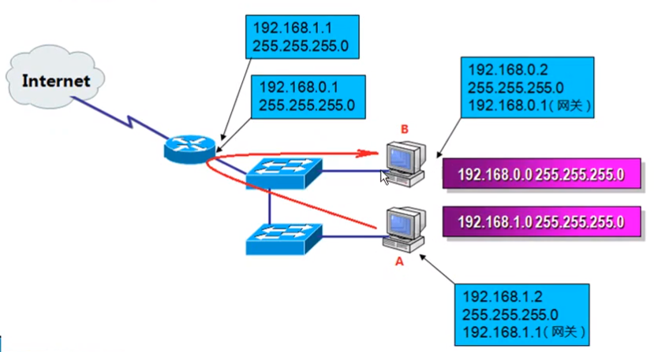


我们可以看到将子网掩码往左移动一位，网络部分就一样了，这两个网段就在一个网段了。

| 192       | 168       | 0000 0000 | 0000 0000 |
| --------- | --------- | --------- | --------- |
| 192       | 168       | 0000 0001 | 0000 0000 |
| 1111 1111 | 1111 1111 | 1111 1110 | 0000 0000 |
| 255       | 255       | 254       | 0         |


合并规律总结

判断一个C类网络能不能合并为一个超网，可参照图中规则，若两个C类网络合并为一个网络，则可以将两个网络的第三部分对4区域，看是否在0、1或者23区域内，不在则说明不可合并。


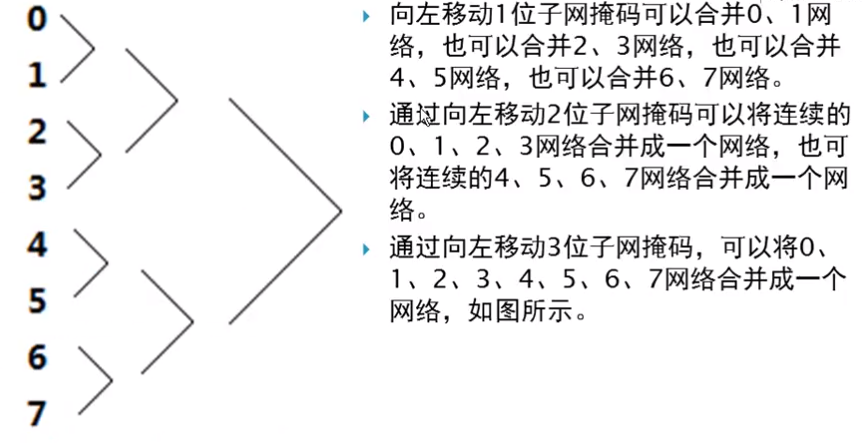


### 4.3.2  使用子网时分组转发

使用子网划分后，路由器必须包括以下三项内容：**目的网络地址**、**子网掩码**和**下一跳地址**。
路由器转发分组算法：

1. 从收到的分组的首部提取目的 IP 地址 D。
2. 先用各网络的子网掩码和 D 逐位相“与”，看是否和相应的网络地址匹配。若匹配，则将分组直接交付。否则就是间接交付，执行(3)。
3. 若路由表中有目的地址为 D 的特定主机路由，则将分组传送给指明的下一跳路由器；否则，执行(4)。
4. 对路由表中的每一行的子网掩码和 D 逐位相“与”，若其结果与该行的目的网络地址匹配，则将分组传送给该行指明的下一跳路由器；否则，执行(5)。
5. 若路由表中有一个默认路由，则将分组传送给路由表中所指明的默认路由器；否则，执行(6)。
6. 报告转发分组出错


### 4.3.3  无分类编址 CIDR（构造超网）

#### 网络前缀

划分子网在一定程度上缓解了因特网在发展中遇到的困难。然而在 1992 年因特网仍然面临三个必须尽早解决的问题，这就是：

- B 类地址在 1992 年已分配了近一半，眼看就要在 1994 年 3 月全部分配完毕！

- 因特网主干网上的路由表中的项目数急剧增长（从几千个增长到几万个）。

- 整个 IPv4 的地址空间最终将全部耗尽。

#### IP 编址问题的演进 

- 1987 年，RFC 1009 就指明了在一个划分子网的网络中可同时使用几个不同的子网掩码。使用变长子网掩码 VLSM (Variable Length Subnet Mask)可进一步提高 IP 地址资源的利用率。

- 在 VLSM 的基础上又进一步研究出无分类编址方法，它的正式名字是无分类域间路由选择 CIDR (Classless Inter-Domain Routing)。 

#### CIDR 最主要的特点 

- CIDR 消除了传统的 A 类、B 类和 C 类地址以及划分子网的概念，因而可以更加有效地分配 IPv4 的地址空间。
- CIDR使用各种长度的“网络前缀”(network-prefix)来代替分类地址中的网络号和子网号。
- IP 地址从三级编址（使用子网掩码）又回到了两级编址。 

#### 无分类的两级编址 

- 无分类的两级编址的记法是： 
  - IP地址 ::= {<网络前缀>, <主机号>}      (4-3) 
- CIDR 还使用“斜线记法”(slash notation)，它又称为CIDR记法，即在 IP 地址面加上一个斜线“/”，然后写上网络前缀所占的位数（这个数值对应于三级编址中子网掩码中 1 的个数）。
- CIDR 把网络前缀都相同的连续的 IP 地址组成“CIDR 地址块”。 


#### CIDR 地址块 

- 128.14.32.0/20 表示的地址块共有 212 个地址（因为斜线后面的 20 是网络前缀的位数，所以这个地址的主机号是 12 位）。
- 这个地址块的起始地址是 128.14.32.0。
- 在不需要指出地址块的起始地址时，也可将这样的地址块简称为“/20 地址块”。
- 128.14.32.0/20 地址块的最小地址：128.14.32.0
- 128.14.32.0/20 地址块的最大地址：128.14.47.255
- 全 0 和全 1 的主机号地址一般不使用。

#### 构造超网

- 前缀长度不超过 23 位的 CIDR 地址块都包含了多个 C 类地址。
- 这些 C 类地址合起来就构成了超网。
- CIDR 地址块中的地址数一定是 2 的整数次幂。
- 网络前缀越短，其地址块所包含的地址数就越多。而在三级结构的IP地址中，划分子网是使网络前缀变长


#### 最长前缀匹配

- 使用 CIDR 时，路由表中的每个项目由“网络前缀”和“下一跳地址”组成。在查找路由表时可能会得到不止一个匹配结果。 

- 应当从匹配结果中选择具有最长网络前缀的路由：最长前缀匹配(longest-prefix matching)。

- 网络前缀越长，其地址块就越小，因而路由就越具体(more specific) 。

- 最长前缀匹配又称为最长匹配或最佳匹配。  

#### 使用二叉线索查找路由表

为了进行更加有效的查找，通常是将无分类编址的路由表存放在一种层次的数据结构中，然后自上而下地按层次进行查找。这里最常用的就是**二叉线索**(binary trie)。

## 4.4  网际控制报文协议 ICMP

- 为了提高 IP 数据报交付成功的机会，在网际层使用了网际控制报文协议 ICMP (Internet Control Message Protocol)。

- ICMP 允许主机或路由器报告差错情况和提供有关异常情况的报告。

- ICMP 不是高层协议，而是 IP 层的协议。

- ICMP 报文作为 IP 层数据报的数据，加上数据报的首部，组成 IP 数据报发送出去。  

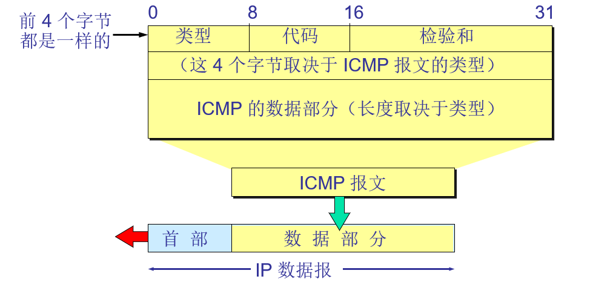

### 4.4.1  ICMP 报文的种类

#### 差错报告报文

ICMP 差错报告报文共有 5 种 

- 终点不可达 

- 源点抑制(Source quench)  

- 时间超过 

- 参数问题 

- 改变路由（重定向）(Redirect)  

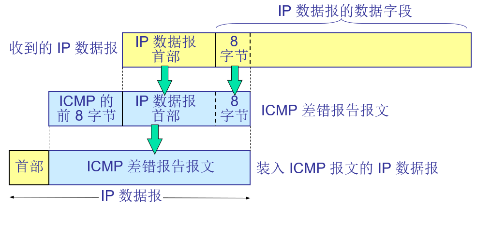

**不应发送 ICMP 差错报告报文的几种情况** 

- 对 ICMP 差错报告报文不再发送 ICMP 差错报告报文。

- 对第一个分片的数据报片的所有后续数据报片都不发送 ICMP 差错报告报文。

- 对具有多播地址的数据报都不发送 ICMP 差错报告报文。

- 对具有特殊地址（如127.0.0.0 或 0.0.0.0）的数据报不发送 ICMP 差错报告报文。


#### 询问报文

ICMP 询问报文有两种 

- 回送请求和回答报文

- 时间戳请求和回答报文

下面的几种 ICMP 报文不再使用

- 信息请求与回答报文

- 掩码地址请求和回答报文

- 路由器询问和通告报文 

### 4.4.2  ICMP 的应用举例

- PING 用来测试两个主机之间的连通性。

- PING 使用了 ICMP 回送请求与回送回答报文。

- PING 是应用层直接使用网络层 ICMP 的例子，它没有通过运输层的 TCP 或UDP。 

ping的应用举例

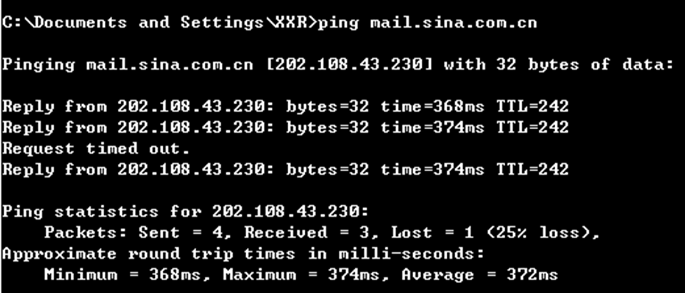

Traceroute 的应用举例

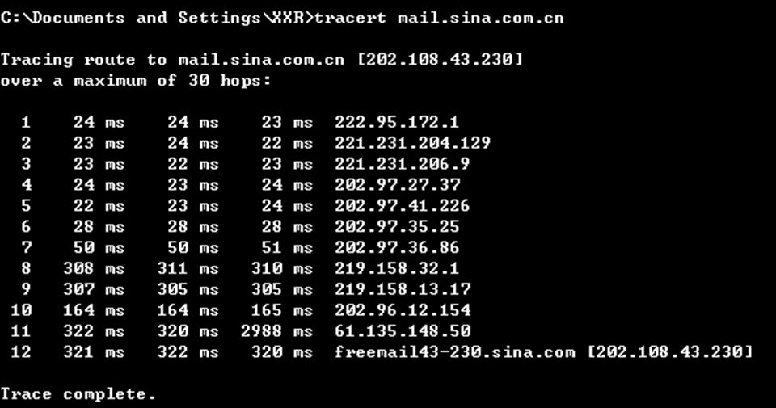

**使用pathping跟踪数据包的路径。**

使用pathping能够判断网络通还是不通，比如请求超时，你就不能判断在什么位置出现的网络故障造成的请求超时，使用pathping就可以跟踪数据包的路径，查出故障点，计算路由器的转发丢包率和链路丢包率和延迟，据此判断出网络拥塞的情况。如图所示

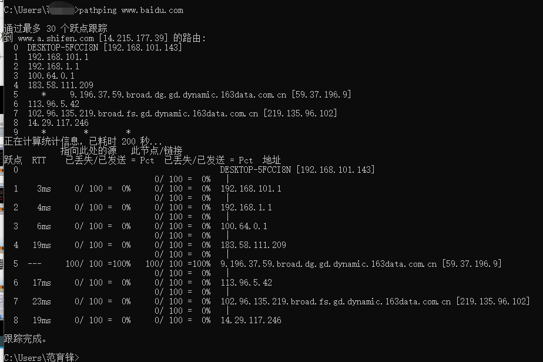


## 4.5  因特网的路由选择协议


### 4.5.1  有关路由选择协议的几个基本概念

#### 1.理想的路由选择

1. 完整与正确
2. 计算简单
3. 能适应通信量与网络拓扑的变化，有自适应性（稳健性）
4. 具有稳定性
5. 应是最佳的，相对于某种特定需求下较为合理的选择

从路由算法的自适应性考虑分两大类：

- 静态路由选择策略（非自适应路由选择）：简单，开销小，但不能适应网络状态的变化
- 动态路由选择策略（自适应路由选择）：能较好适应网络状态的变化，但实现较为复杂，开销大

#### 2.分层次的路由选择协议

将互联网划分为许多小的自治系统，记为AS，一个AS对其他AS表现出**单一的和一致的路由选择策略**。
互联网把路由选择协议划分为两大类：

1. **内部网关协议IGP**：自治系统内部使用的路由选择协议，如**RIP和OSPF**
2. **外部网关协议EGP**：当源主机与目的主机处在不同的自治系统中所使用的路由选择协议，目前使用最多的是**BGP-4**

自治系统之间的路由选择也叫做**域间路由选择**(interdomain routing)，
在自治系统内部的路由选择叫做**域内路由选择**(intradomain routing)

分析：
本路由器与相邻路由器相距为1，通过相邻路由表可知，本路由器经过相邻路由器到达目的地址的距离会加1，所以d+1，下一跳设置为X。然后对路由表进行比较，目的地址未知则直接添加，目的地址已知，看本路由表下一跳是否为X，如果是，则更新，因为这是最新消息。如果不是，比较距离，距离比原来小可添加。如果长时间收不到更新路由表，则自动标记为不可达。

**RIP2 协议的报文格式**


RIP 协议的优缺点

- RIP 存在的一个问题是当网络出现故障时，要经过**比较长的时间**才能将此信息传送到所有的路由器。
- RIP 协议最大的优点就是**实现简单，开销较小**。
- RIP 限制了网络的规模，它能使用的**最大距离为 15**（16 表示不可达）


### 4.5.2  内部网关协议 RIP

RIP是一种分布式的基于距离向量的路由选择协议，网关就是默认路由**“距离”的定义**：

- 从一路由器到直接连接的网络的距离定义为 1。从一个路由器到非直接连接的网络的距离定义为**所经过的路由器数加 1**。
- RIP 协 议 中 的 **“ 距 离 ” 也 称 为 “ 跳数”(hop count)**，因为每经过一个路由器，跳数就加 1。
- RIP 允许一条路径最多只能包含 15 个路由器。**“距离”的最大值为16 时即相当于不可达**。可见 RIP 只适用于小型互联网。


```java
路由选择算法
已知地址为X的相邻路由器发来RIP报文，先将收到的报文下一跳该为X，
所有距离加1，再对该表与自身路由表逐条进行比较。
if（原路由表无目的网络N）{
	将该项目添加到路由表中}
if else（本机路由表下一跳为X）{
	将该条更新原本的项目}
if else（距离<原来）{
	更新该条到路由表}
else{
	不做更新操作}
if（三分钟收不到更新路由表）{
	将此相邻路由表距离设置为16（不可达）}
```

分析：
本路由器与相邻路由器相距为1，通过相邻路由表可知，本路由器经过相邻路由器到达目的地址的距离会加1，所以d+1，下一跳设置为X。然后对路由表进行比较，目的地址未知则直接添加，目的地址已知，看本路由表下一跳是否为X，如果是，则更新，因为这是最新消息。如果不是，比较距离，距离比原来小可添加。如果长时间收不到更新路由表，则自动标记为不可达。


**RIP协议缺点**：
RIP 不能在两个网络之间同时使用多条路由。RIP 选择一个具有最少路由器的路由（即最短路由），哪怕还存在另一条高速(低时延)但路由器较多的路由。
RIP 协议的**三个要点**：

- 仅和**相邻路由器**交换信息。
- 交换的信息是**当前本路由器所知道的全部信息**，即自己的路由表。
- **按固定的时间间隔交换路由信息**，例如，**每隔 30 秒**（广播）。

**RIP2协议的报文格式**


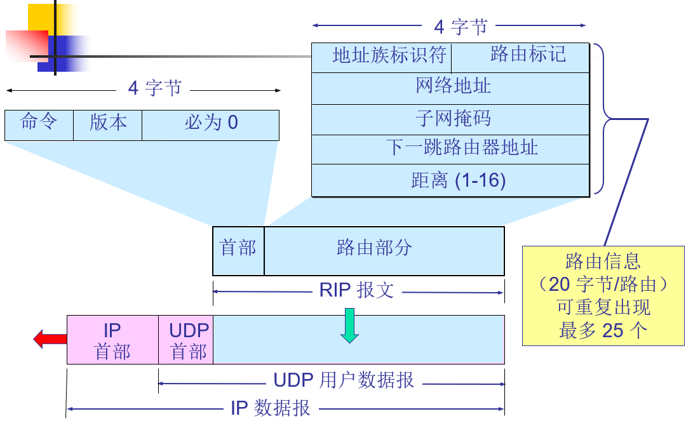

- RIP2 报文中的路由部分由若干个路由信息组成。每个路由信息需要用 20 个字节。地址族标识符（又称为地址类别）字段用来标志所使用的地址协议。

- 路由标记填入自治系统的号码，这是考虑使RIP 有可能收到本自治系统以外的路由选择信息。再后面指出某个网络地址、该网络的子网掩码、下一跳路由器地址以及到此网络的距离。 nRIP2 报文中的路由部分由若干个路由信息组成。每个路由信息需要用 20 个字节。地址族标识符（又称为地址类别）字段用来标志所使用的地址协议。

 

### 4.5.3  内部网关协议 OSPF

**开放的最短路径优先**OSPF，主要特征是使用分布式的**链路状态协议**。
要点：

1. 使用**泛洪法**，向本自治系统所有·路由器发送信息
2. 发送的是有本路由器**相邻的所有路由器的链路状态**
3. 只有**链路状态改变**时才使用泛洪发送信息

OSPF 将一个自治系统再划分为若干个更小的范围，叫作**区域**。区域也不能太大，在一个区域内的路由器最好**不超过 200 个**。


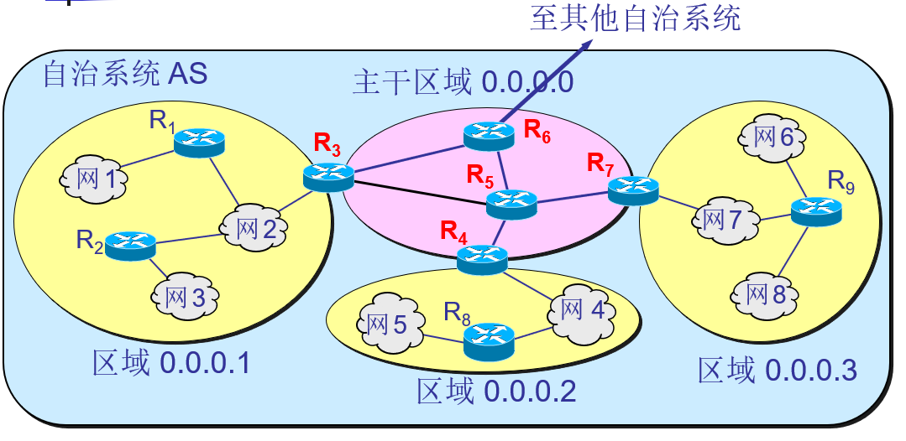

OSPF建立**网络拓扑结构图**的方式：

1. 首先每个路由器会每10s对相邻的路由器**发送问候（Hello）分组**，来维持相邻路由器的可达性。
2. 通过交换得到的链路状态信息，建立**链路状态数据库**，构造全网的拓扑结构图。
3. 当链路状态发生改变时，每个路由器都能及时**更新同步数据库**。

OSPF 直接用 IP 数据报传送，OSPF 不用 UDP 而是直接用 IP 数据报传送。OSPF 构成的数据报很短。这样做可减少路由信息的通信量。数据报很短的另一好处是可以不必将长的数据报分片传送。分片传送的数据报只要丢失一个，就无法组装成原来的数据报，而整个数据报就必须重传。

**OSPF 分组** 

 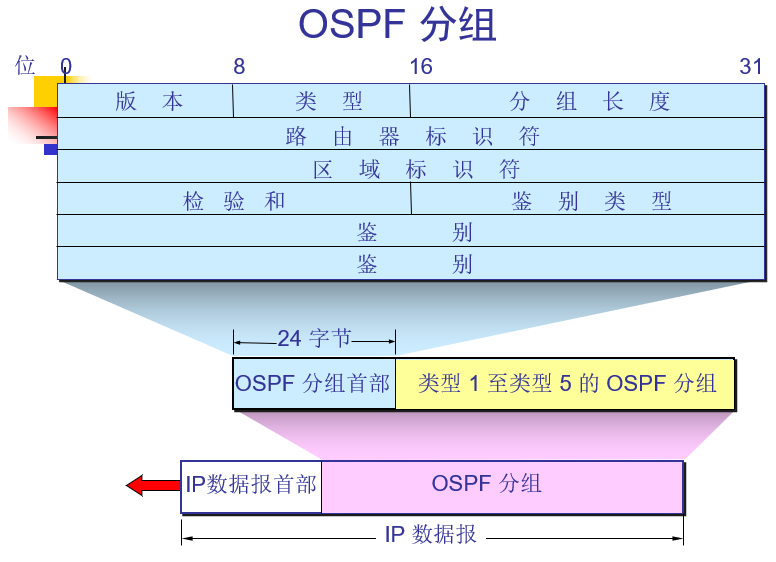

OSPF 的五种分组类型 

- 类型1，问候(Hello)分组。

- 类型2，数据库描述(Database Description)分组。

- 类型3，链路状态请求(Link State Request)分组。

- 类型4，链路状态更新(Link State Update)分组，用洪泛法对全网更新链路状态。

- 类型5，链路状态确认(Link State Acknowledgment)分组。 

**洪泛法**

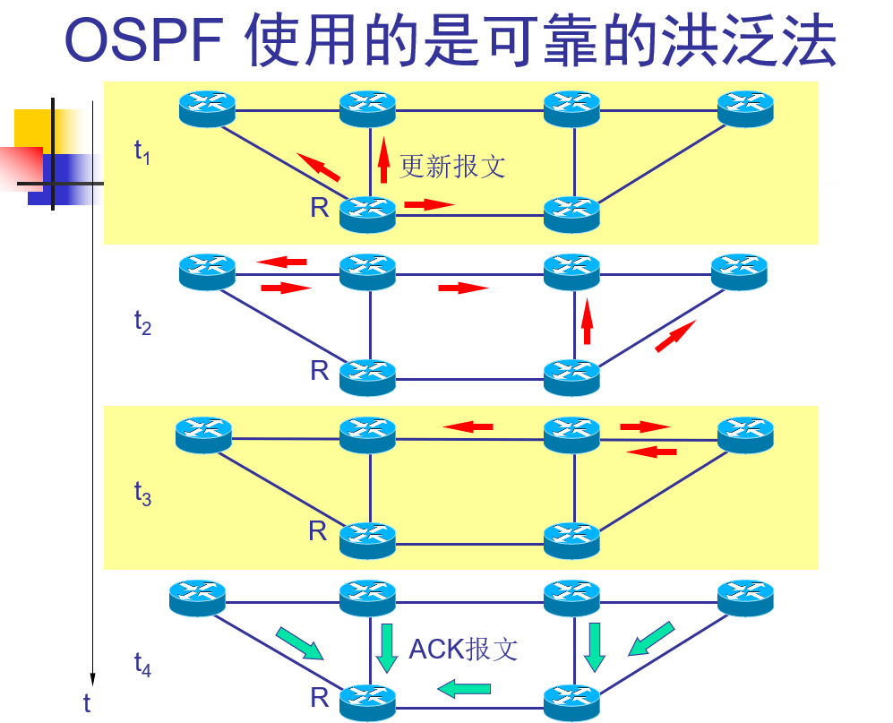


### 4.5.4  外部网关协议 BGP 

边界网关协议 BGP 只能是力求寻找一条能够**到达目的网络且比较好的路由**（不能兜圈子），而并非要寻找一条最佳路由。每一个自治系统的管理员要选择至少一个路由器作为该自治系统的“ **BGP 发言人**” ，一般为BGP边界路由器。


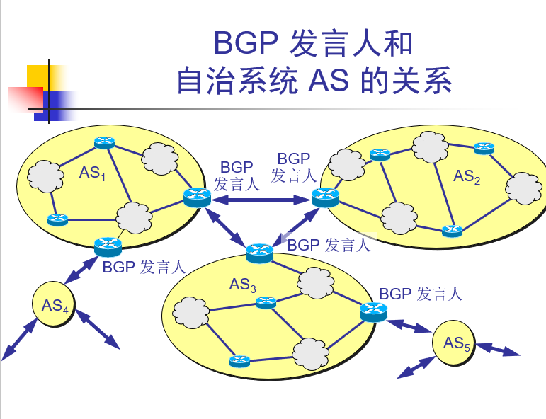


通过BGP协议可将上图的网络看做是如下形式：

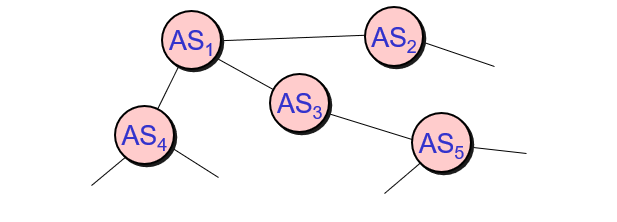

进而实现多级ISP的网络多级结构


### 4.5.6  路由器的构成 

- 路由器是一种具有多个输入端口和多个输出端口的专用计算机，其任务是转发分组。也就是说，将路由器某个输入端口收到的分组，按照分组要去的目的地（即目的网络），把该分组从路由器的某个合适的输出端口转发给下一跳路由器。

- 下一跳路由器也按照这种方法处理分组，直到该分组到达终点为止。 


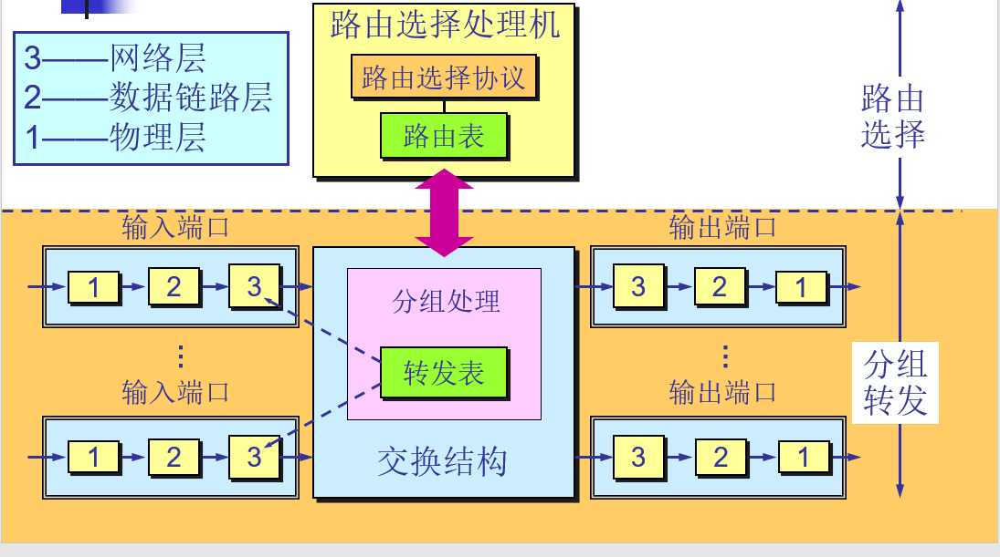


## 4.6  IP 多播


### 4.6.1  IP 多播的基本概念

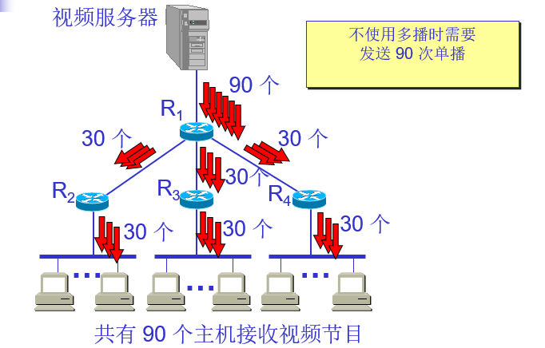

多播可明显地减少网络中资源的消耗

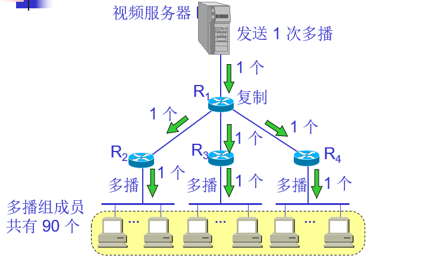

IP 多播的一些特点 

(1) 多播使用组地址—— IP 使用 D 类地址支持多播。多播地址只能用于目的地址，而不能用于源地址。 

(2) 永久组地址——由因特网号码指派管理局 IANA 负责指派。

(3) 动态的组成员 

(4) 使用硬件进行多播

### 4.6.2  在局域网上进行硬件多播

- 因特网号码指派管理局 IANA 拥有的以太网地址块的高 24 位为 00-00-5E。

- 因此 TCP/IP 协议使用的以太网多播地址块的范围是：从 00-00-5E-00-00-00到 00-00-5E-FF-FF-FF 

- D 类 IP 地址可供分配的有 28 位，在这 28 位中的前 5 位不能用来构成以太网硬件地址。

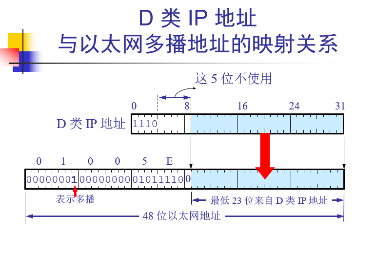

### 4.6.2  因特网组管理协议 IGMP 和多播路由选择协议

**IP多播需要两种协议**

- 为了使路由器知道多播组成员的信息，需要利用网际组管理协议 IGMP (Internet Group Management Protocol)。

- 连接在局域网上的多播路由器还必须和因特网上的其他多播路由器协同工作，以便把多播数据报用最小代价传送给所有的组成员。这就需要使用多播路由选择协议。 

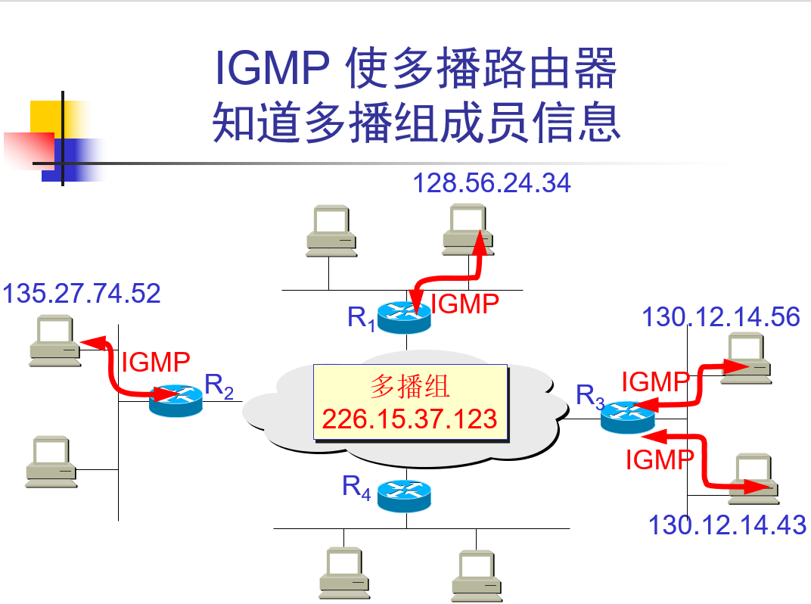

**IGMP**

 IGMP是一个单独的协议，属于整个网际协议 IP 的一个组成部分。 

**IGMP 可分为两个阶段** 

第一阶段：当某个主机加入新的多播组时，该主机应向多播组的多播地址发送IGMP 报文，声明自己要成为该组的成员。本地的多播路由器收到 IGMP 报文后，将组成员关系转发给因特网上的其他多播路由器。

第二阶段：因为组成员关系是动态的，因此本地多播路由器要周期性地探询本地局域网上的主机，以便知道这些主机是否还继续是组的成员。只要对某个组有一个主机响应，那么多播路由器就认为这个组是活跃的。但一个组在经过几次的探询后仍然没有一个主机响应，则不再将该组的成员关系转发给其他的多播路由器。

## 4.7  虚拟专用网 VPN 和网络地址转换 NAT

### 4.7.1  虚拟专用网 VPN

- 本地地址——仅在机构内部使用的 IP 地址，可以由本机构自行分配，而不需要向因特网的管理机构申请。
- 全球地址——全球唯一的IP地址，必须向因特网的管理机构申请

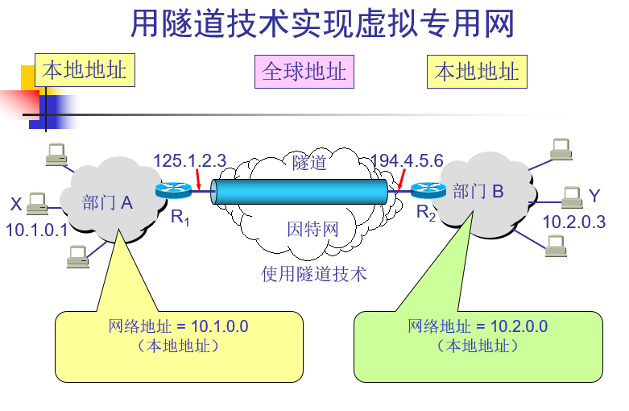

A与B内部的通信本来不经过互联网，如果两者之间想要通信，可使用VPN技术，A将数据报作为内部数据发给路由器R1，路由器R1收到数据报后，对内部数据报加密（保证数据安全），然后重新加上数据报的首部，封装成互联网的外部数据报，到达R2，然后在进行解密，从而实现两者间的通信

### 


### 4.7.2  网络地址转换 NAT

NAT原理：
内部主机 X 用本地地址 IPX 和因特网上主机 Y 通信所发送的数据报必须经过 NAT 路由器。NAT 路由器将**数据报的源地址 IPX 转换成全球地址 IPG**，但目的地址 IPY 保持不变，然后发送到因特网。NAT 路由器收到主机 Y 发回的数据报时，知道数据报中的源地址是 IPY 而目的地址是 IPG。根据 NAT 转换表，NAT 路由器将目的地址 IPG转换为 IPX，转发给最终的内部主机 X。

现常用的NAT转换表利用**运输层的端口号**，使得多个拥有本地地址的主机共用一个路由器上的全球IP地址，使用端口号的NAT也叫网络地址与端口号转换NAPT。

使用**netstat -n** 可查看建立会话的目**标端口**和**源端口**

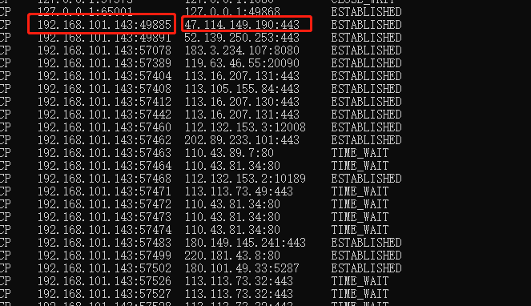