[TOC]

# 计算机网络

这学期上了计算机网络的课程，觉得这门课十分有用，使我对于网络各个方面的内容有了大致的了解，现在暑假来了，准备复习总结，准备开学的考试，还有面试准备。

## 计算机网络的定义和分类

### 计算机网络的定义

​		首先，什么是计算机网络呢？一般认为，计算机网络是一个将分散的/具有独立功能的计算机系统，通过通信设备和线路连接起来，由功能完善的软件实现资源共享和信息传递的系统。简而言之，计算机网络就是一些互联的、自治的计算机系统的集合。是网络的网络，互联网把许多网络连接在一起。

### 计算机网络的分类

​		**1、按分布范围**

- 广域网（WAN），广域网的任务是提供长距离通信，运送主机所发送的数据，覆盖范围通常为几万米到几十万米的区域。

- 城域网（MAN），城域网的覆盖范围可以跨越几个街区甚至整个城市，范围大概5-50km。

- 局域网（LAN），局域网一般是用微机或者工作站通过高速线路相连接，覆盖范围较小，一般几十米到几千米的区域；局域网在计算机配置的数量上没有太多限制，少的可以只有2台，多的可以有几百台。传统上，局域网采用广播技术，广域网采用交换技术。、

- 个人区域网（PAN）。个人区域网是指在个人工作的地方将电子设备用无线技术连接起来的网络，也常常称为无线个人区域网，覆盖直径大小约为10m。

  **2、按传输技术分类**

- 广播式网络：所有的联网计算机都共享一个公共的通信信道，当一台计算机利用共享的通信信道发送报文分组时，所有其他的计算机都会收听到这个分组，接收到该分组的计算机通过检查目的地址，来决定是否接受该分组，`局域网基本上都采用广播式通信技术，广域网中的无线、卫星通信网络也采用广播式通信技术`

- 点对点网络：每条物理线路链接一对计算机。如果通信的两台主机之间没有直接相连的线路，那么他们呢之间的分组传输通过中间结点的接收、存储和转发，直至目的节点。`广域网基本属于点对点网络`

  **3、按使用者分类**

- 公用网

- 专用网

  **4、按拓扑结构分类**

- 星型网络

- 总线型网络

- 环形网络

- 网状型网络

  **5、按交换技术分类**

- **电路交换网络：**电路交换用于电话通信系统，两个用户要通信之前需要建立一条专用的物理链路，并且在整个通信过程中始终占用该链路。由于通信的过程中不可能一直在使用传输线路，因此电路交换对线路的利用率很低，往往不到 10%。适用于数据量很大的实时通信

- **报文交换网络：**报文交换用于邮局通信系统，邮局接收到一份报文之后，先存储下来，然后把相同目的地的报文一起转发到下一个目的地，这个过程就是存储转发过程。

- **分组交换网络：**分组交换也使用了存储转发，但是转发的是分组而不是报文。把整块数据称为一个报文，由于一个报文可能很长，需要先进行切分，来满足分组能处理的大小。在每个切分的数据前面加上首部之后就成为了分组，首部包含了目的地址和源地址等控制信息。

  - 优点：高效、灵活、迅速、可靠
  - 缺点：时延大、开销大

  三种交换方式的比较 

  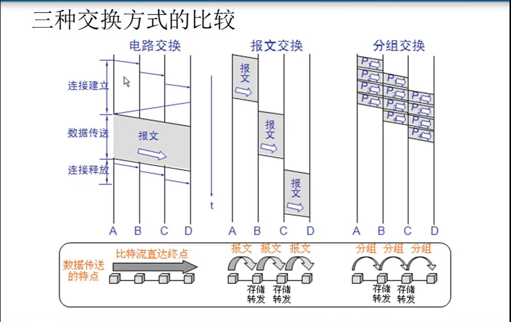

  **6、按传输介质分类**

- 有线网和无线网络

**几种常用的信道复用技术**

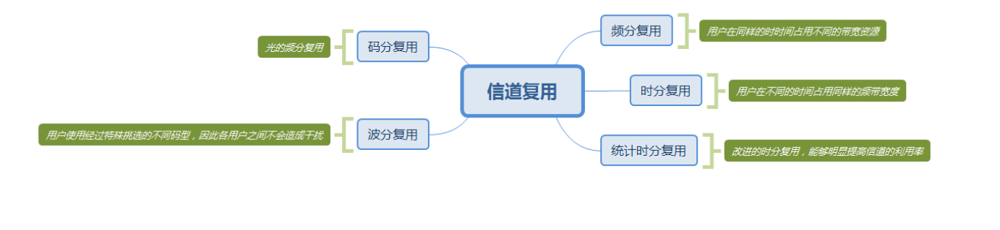

## 计算机网络的性能指标

1. 带宽：表示网络通信线路所能传送数据的能力，时数字信道所能传送的**“最高数据率”**。单位时bit/s 比特每秒。

2. 时延：指一个数据由一段传送到另一端所需要的时间，由以下四部分组成
   1. 发送时延:主机或路由器发送数据帧所需要的时间，即：从发送数据帧的第一个比特算起到该帧的最后一个比特发送完毕所需要的时间。
   
      > 计算公式：发送时延=分组长度/信道宽度 
   
   2. 传播时延:电磁波在信道中传播一定的距离需要花费的时间。
   
      > 计算公式：传播时延=信道长度/电磁波传播速率 
   
   3. 处理时延:主机或路由器在收到分组时要花费一定的时间进行处理。例如：分析分组的首部信息、从分组中提取数据部分、进行差错检验或查找适当的路由等等。
   
   4. 排队时延:分组在经过网络传输时，要经过许多路由器。但分组在进入路由器后要先在输入队列中排队等待处理。排队时延的长短取决于网络中的通信量。
   
      > 总时延：排队时延+发送时延+传播时延+处理时延
   
3. 时延带宽积：指发送端连续发送的数据且发送的第一个比特发送即将到达终点时，发送端已经发送的比特数、即传播时延*带宽

4. 吞吐量：指单位时间内通过某个网络的数据量

5. 速率：计算机网络在数字信道上的传播速率，b/s（比特每秒）

6. 往返时间(RTT)：从发送方发送数据开始，到发送方收到接收方确认。

   > 发送时间=数据长度/发送速率

   > 有效数据率=数据长度/（发送时间+RTT）

## 计算机网络的体系结构

### 基本概念

- ISO：国际化标准组织
- OSI/RM:互联网**法律上**的国际标准

- TCP/IP Suite:因特网**实际上**的国家标准

- Network Protocols:数据交换遵守的**标准、规则、约定**。

- 网络体系结构：计算机网络**各层及其协议**的**集合**。

  计算机网络分层可以使整个计算机网络各层之间**独立**，**灵活性好**，结构上**可分割**开，能**促进标准化**工作，呈现**高内聚和低耦合**，易于**实现和维护**。

### OSI参考模型（7层）和TCP/IP模型

#### OSI参考模型（7层）

1. **应用层**：能够产生**网络流量**和用户交互的程序

2. **表示层**：两个通信系统交换信息的表示方式，加密、压缩等、开发人员需考虑。

3. **会话层：**不同主机之间的各个进程建立会话（netstat -nb 可查看木马程序）

   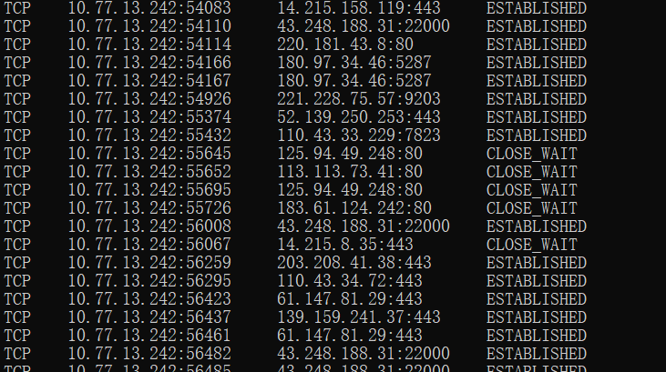 

4. **传输层：**为主机建立进程间的通信，提供端到端的可靠传输服务，提供流量控制，服务质量，数据传输管理；传输层的协议有UDP、TCP。

5. **网络层：**IP地址编址，选择最佳路径

6. **数据链路层：**封装数据、差错控制、添加物理层地址、MAC地址w

7. **物理层：**定义通信设备的数据通信设备和逻辑链接方法，还有电压标准，接口标准，如机械特性，电气特性，功能特性，过程特性。

#### TCP/IP模型（四层）

- 应用层：包括OSI模型的应用层、表示层、会话层
- 传输层：对应OSI的传输层
- 网络层：对于OSI的网络层
- 网络接口层：对于OSI接口的数据链路层和物理层

两个模型的比较：

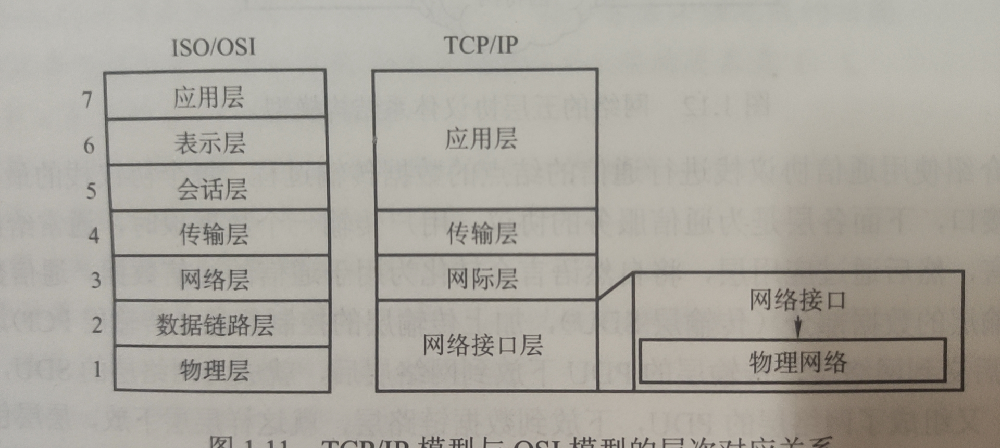

学习计算机网络时，我们往往采用折中的办法，即综合OSIhe TCP/Ip 的优点，如图所示

**五层协议对应的数据单元：**

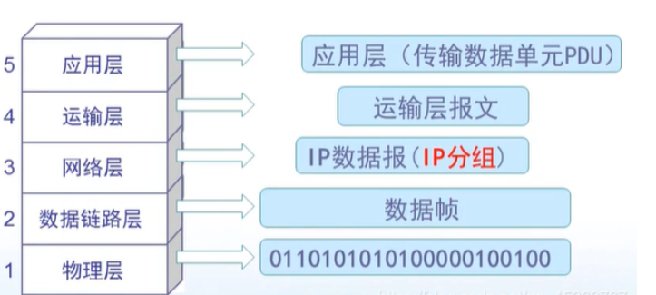

###  OSI与TCP/IP各层的结构与功能、协议

在应用层交互的数据叫报文，报文经过运输层（TCP/UDP）转换成段，然后在网络层经过路径选择，在首部添加IP地址变成数据包（也叫**IP数据报**），在数据链路层加上MAC地址组装成**帧**，在物理层传输时加上帧头帧位变成比特流。

### 数据在各层之间的传递过程

下面为两个主机之间发送数据的整个过程：

在向下的过程中，需要添加下层协议所需要的首部或者尾部，而在向上的过程中不断拆开首部和尾部。

路由器只有下面三层协议，因为路由器位于网络核心中，不需要为进程或者应用程序提供服务，因此也就不需要传输层和应用层。

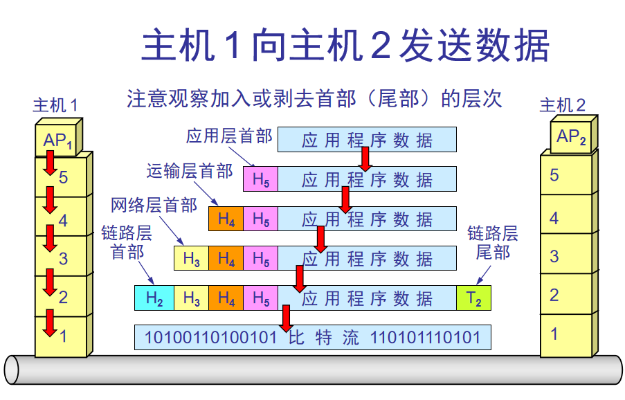

**计算机 2 的物理层收到比特流后交给数据链路层**

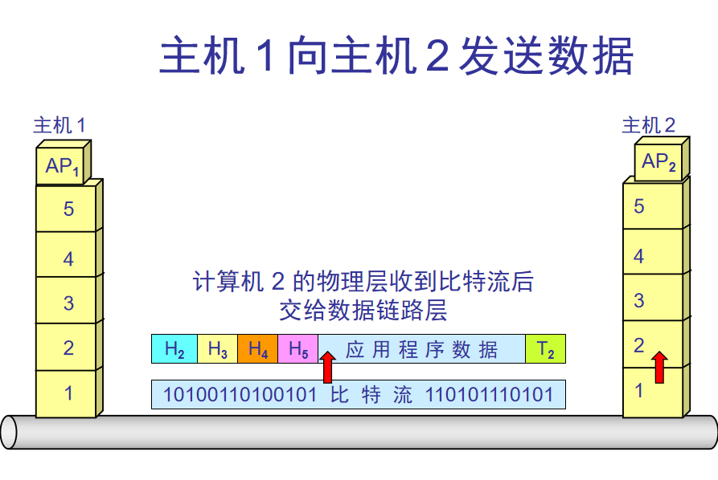

**数据链路层剥去帧首部和帧尾部后把帧的数据部分交给网络层**

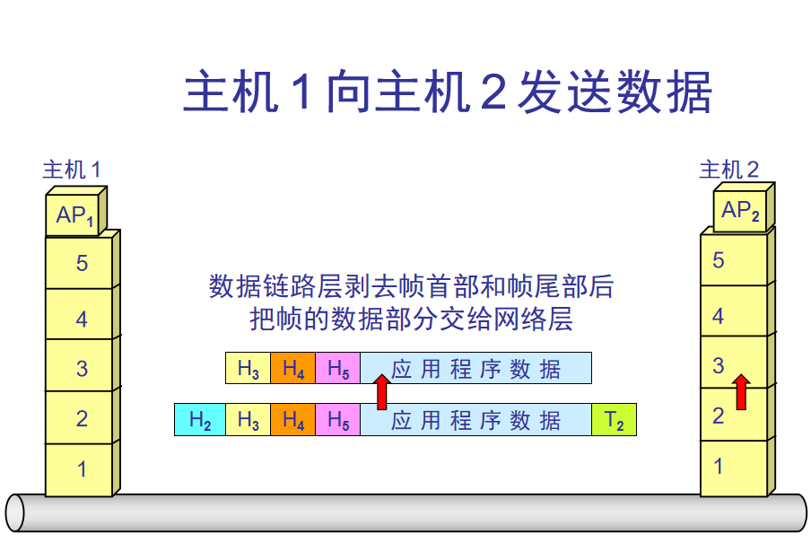

**网络层剥去分组首部后把分组的数据部分交给运输层**

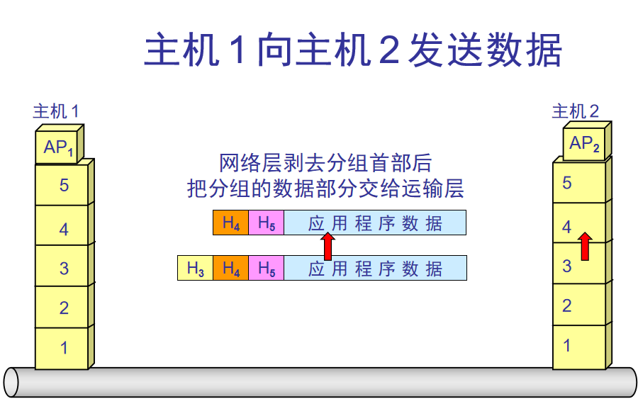

**应用层剥去应用层 PDU 首部后把应用程序数据交给应用进程**

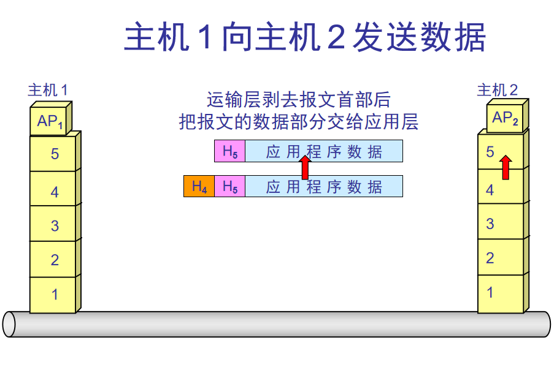

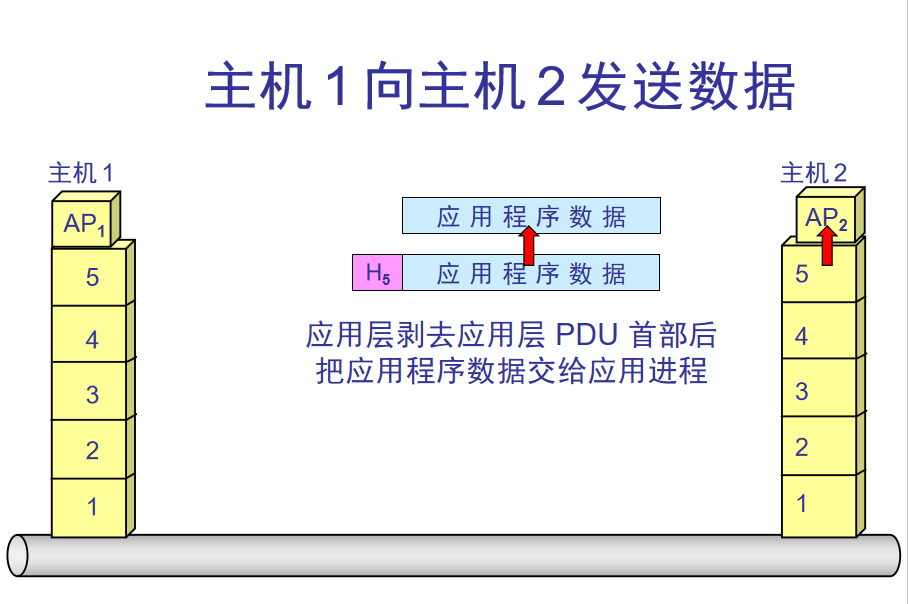

这样就收取到了主机AP1发来的应用程序数据

## 重要的知识点总结

1. 计算机网络把许多计算机连接在一起，而互联网把许多网络连接在一起，是网络的网络。
2. 小写字母i开头的internet（互联网）是通用名词，它泛指由多个计算机网络相互连接而成的网络。在这些网络之间的通信协议（即通信规则）可以是任意的。
3. 大写字母I开头的Internet（互联网）是专用名词，它指全球最大的，开放的，由众多网络相互连接而成的特定的互联网，并采用TCP/IP协议作为通信规则，其前身为ARPANET。Internet的推荐译名为因特网，现在一般流行称为互联网。
4. 路由器是实现分组交换的关键构件，其任务是转发收到的分别，这是网络的核心部分最重要的功能。分组交换采用存储转发的技术，表示把一个报文分成几个分组后在进行传送，在发送报文之前，先把报文划分成为一个个更小的等长数据段。在每个数据段的前面加上一些由必要的控制信息组成的首部后，就构成了一个分组，分组又称为包，分组时在互联网中传送的数据单元，正是由于分组的头部包含了诸如目的地址和源地址等重要的控制信息，每一个分组才能在互联网中独立选择传输路径，并且正确的交付分组传输的终点。
5. 互联网按工作方式可划分为边缘部分和核心部分。主机在网络的边缘部分，其作用是进行信息处理，由大量的网络和连接这些网络的路由器组成核心部分，其作用是提供联通性和交换。
6. 计算机通信是计算机中进程（即运行着的程序）之间的通信。计算机网络采用的通信方式是客户-服务器方式（C/S方式）和对等连接方式（P2P方式）。
7. 客户和服务器都是指通信中所涉及的应用进程。客户是服务请求方，服务器是服务提供方。
8. 按照作用范围的不同，计算机网络分为广域网WAN，城域网MAN，局域网LAN，个人区域网PAN。
9. 计算机网络最常用的性能指标是：速率，带宽，吞吐量，时延（发送时延，处理时延，排队时延），时延带宽积，往返时间和信道利用率。
10. 网络协议即协议，是为进行网络中的数据交换而建立的规则。计算机网络的各层以及其协议集合，称为网络的体系结构。
11. 五层体系结构由应用层，运输层，网络层（网际层），数据链路层，物理层组成。运输层最主要的协议是TCP和UDP协议，网络层最重要的协议是IP协议。